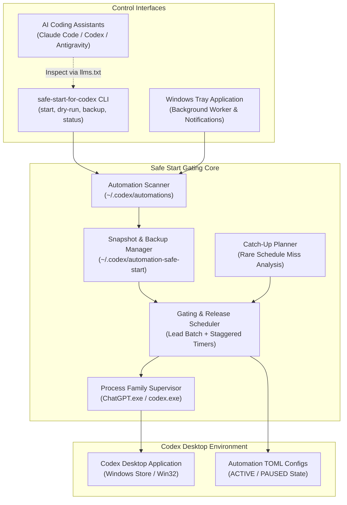
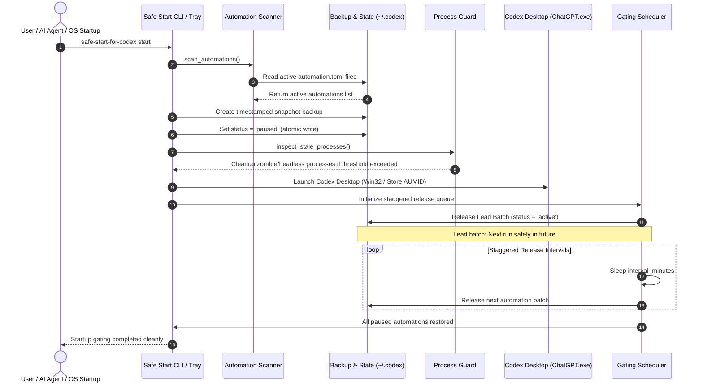

# Safe Start for Codex

Unofficial Windows startup gate for Codex Desktop automations and catch-up pacing.

<p align="center">
  
</p>

<p align="center">
  <a href="pyproject.toml"></a>
  <a href="NOTICE"></a>
  <a href="https://github.com/dev-bricks/safe-start-for-codex/actions/workflows/ci.yml"></a>
  <a href="https://github.com/dev-bricks/safe-start-for-codex/actions/workflows/source-platform-smoke.yml"></a>
  <a href="tests/"></a>
  
  
  
  
  <a href="SECURITY.md"></a>
  <a href="THIRD_PARTY_LICENSES.md"></a>
  <a href="CHANGELOG.md"></a>
  <a href="MARKETING-LOG.txt"></a>
  <a href="LICENSE"></a>
  <a href="https://github.com/dev-bricks"></a>
  <a href="https://github.com/open-bricks"></a>
  <a href="llms.txt"></a>
</p>

**[English](README.md)** | **[Deutsch](README_de.md)**

> [!NOTE]
> **AI Agent & Codex Automation Integration:** Safe Start for Codex is designed to be inspected, invoked, and verified by local AI coding assistants (Claude Code, Codex CLI, Gemini Antigravity, Kimi). Structured machine-readable context is maintained in [`llms.txt`](llms.txt).

---

### 🧭 Quick Navigation

1. [Why & Problem Statement](#sec-01)
2. [Architecture & System Flow](#sec-02)
3. [Complete Lifecycle Sequence](#sec-03)
4. [Key Capabilities, Governance & Runtime Invariants](#sec-04)
5. [Target Personas & Discoverability](#sec-05)
6. [Comparative Matrix & Alternatives](#sec-06)
7. [Sibling Ecosystem & Partner Tools](#sec-07)
8. [Features & Capabilities](#sec-08)
9. [Visual Architecture & Branding](#sec-09)
10. [Requirements & Platform Matrix](#sec-10)
11. [Installation & Quick Start](#sec-11)
12. [CLI Usage & Subcommands](#sec-12)
13. [Configuration & Tuning](#sec-13)
14. [Conservative Catch-Up Planner & Upstream Proposal](#sec-14)
15. [Windows Tray Mode & Process Supervision](#sec-15)
16. [Third-Party Licenses & Level 1 SBOM](#sec-16)
17. [Development, Quality Assurance & License](#sec-17)
18. [Statutory Notice (§ 521 BGB) & Liability Disclaimer](#sec-18)

---

<a id="sec-01"></a><a id="why--problem-statement"></a><a id="warum--problemstellung"></a>
## 1. Why & Problem Statement

Safe Start for Codex is a lightweight Python utility and Windows startup gate designed for developers and AI engineers who operate multiple local Codex Desktop automations. When Codex Desktop opens, recurring automations scheduled during system downtime, sleep, or reboots often trigger simultaneously. This causes sudden startup surges, CPU throttling, disk saturation, immediate API quota exhaustion, and severe UI lockups.

| Challenge Without Safe Start | Impact on Developer Workstation | Safe Start for Codex Solution |
|:---|:---|:---|
| **Simultaneous Startup Surge** | All due automations fire simultaneously upon boot | Automations are paused before boot and unpaused in rate-limited batches |
| **System Load & API Spikes** | CPU, disk, and API tokens surge instantaneously | Predictable, staggered resource consumption via configurable release delays |
| **Stale Process Leftovers** | Orphaned `codex.exe` or `ChatGPT.exe` instances linger silently | Automatic zombie-process supervision with conservative age safeguards |
| **Configuration Mutation Risks** | Manual TOML edits risk syntax errors and data loss | Atomic writes via temporary staging and automated snapshot backups |
| **Missed Rare Schedules** | Infrequent automations (e.g. weekly/monthly) execute haphazardly | Read-only catch-up planning identifies missed runs without force-running |

Safe Start intercepts this startup cascade cleanly:
1. It takes an atomic snapshot backup of all active automations before modifying any files.
2. It sets active automations to `PAUSED` before launching Codex Desktop.
3. It launches Codex Desktop cleanly in unprivileged user mode (`RunAsInvoker`).
4. It releases an initial lead batch whose schedule lies safely in the future.
5. It releases remaining automations gradually in staggered background intervals.

This project is an independent open-source tool and is not affiliated with, endorsed by, or maintained by OpenAI.

---

<a id="sec-02"></a><a id="architecture--system-flow"></a><a id="architektur--systemfluss"></a>
## 2. Architecture & System Flow



---

<a id="sec-03"></a><a id="complete-lifecycle-sequence"></a><a id="vollstaendiger-lebenszyklus-ablauf"></a><a id="vollständiger-lebenszyklus-ablauf"></a>
## 3. Complete Lifecycle Sequence



---

<a id="sec-04"></a><a id="key-capabilities--safety-invariants"></a><a id="kernfaehigkeiten--sicherheitsinvarianten"></a><a id="kernfähigkeiten--sicherheitsinvarianten"></a>
## 4. Key Capabilities, Governance & Runtime Invariants

Safe Start for Codex enforces 10 strict architectural and runtime invariants:

| # | Invariant ID | Guarantee Name | Scope | Guarantee & Verification |
|---|:---|:---|:---|:---|
| 1 | `INV-LOCAL-01` | **Local-First & Zero Egress** | Network | 100% offline; zero network calls, telemetry, or remote tracking. All state is host-local. |
| 2 | `INV-SEC-02` | **Non-Elevation (User-Mode)** | Security | Operates strictly with standard user permissions (`RunAsInvoker`). Never requests or requires UAC or administrator elevation. |
| 3 | `INV-FILE-03` | **Snapshot-Before-Mutation** | Data Safety | Creates an atomic backup in `~/.codex/automation-safe-start/backups/` before altering any `automation.toml`. |
| 4 | `INV-RESTORE-04` | **Selective Restoration Guard** | Idempotency | Only restores automations paused by Safe Start in that session. Previously disabled automations remain paused. |
| 5 | `INV-CATCH-05` | **Conservative Catch-Up Policy** | Scheduling | Catch-up planning is strictly read-only; never triggers manual "Run now" actions or forces immediate execution. |
| 6 | `INV-PROC-06` | **Targeted Process Supervision** | OS Processes | Stale process termination is constrained to recognized Codex process names (`ChatGPT.exe`, `codex.exe`) with zombie age safeguards. |
| 7 | `INV-INTEG-07` | **Atomic TOML Serialization** | Integrity | Configuration and state writes use temporary file staging and atomic renames to prevent corruption on abrupt termination. |
| 8 | `INV-FAIL-08` | **Fail-Closed Diagnostics** | Reliability | Malformed configs or unhandled filesystem states log descriptive errors and halt without modifying active files. |
| 9 | `INV-PLAT-09` | **Cross-Platform Operating Parity** | Portability | Windows-targeted production execution with multi-OS source parsing smoke tests across Linux and macOS. |
| 10 | `INV-SLA-10` | **Dual Security Response SLA** | Governance | Strict commitment to 48-hour initial response and 5-business-day triage via canonical security channels. |

---

<a id="sec-05"></a><a id="target-personas--discoverability"></a><a id="zielgruppen--auffindbarkeit"></a>
## 5. Target Personas & Discoverability

Safe Start for Codex is architected for specific high-value developer workflows:

### Target Personas

- **`[PERSONA-01]` Windows Codex Desktop Power Users & Prompt Engineers:** Running dozens of recurring automations and morning briefs without dealing with CPU lockups, rate limit throttling, or desktop lag on system resume.
- **`[PERSONA-02]` Autonomous Multi-Agent Swarm Operators:** Orchestrating swarms (Claude Code, Codex CLI, Gemini Antigravity, Kimi) where background tasks must launch deterministically without leaving orphaned zombie processes.
- **`[PERSONA-03]` DevOps & System Reliability Engineers (SREs):** Requiring atomic configuration safety, snapshot-before-mutation backups, and predictable workstation startup behaviors.
- **`[PERSONA-04]` Enterprise Security & Compliance Auditors:** Requiring strictly unprivileged user-mode execution (`RunAsInvoker`), 100% local-first zero-egress operation, and fully audited permissive open-source licenses.

### High-Intent Search Phrases & Keywords
- `safe-start-for-codex` / `Safe Start for Codex`
- `codex desktop automation startup gate`
- `prevent codex desktop startup surge`
- `windows codex automation scheduler guard`
- `staggered release codex automations python`
- `codex automation catch-up planner offline`
- `codex zombie process cleanup python`
- `dev-bricks safe start for codex`
- `local-first zero-egress codex gate`

### Disambiguation & Ecosystem Positioning
The canonical repository is `dev-bricks/safe-start-for-codex`. It is not OpenAI Codex itself, not an OpenAI fork, and not a replacement task scheduler. Broad web searches for "Codex startup" often collide with generic tutorials, sandboxing articles, or prompt-engineering repositories. Safe Start provides:
- **Atomic Pre-Boot Gating:** Pauses active automations before the desktop app even loads.
- **Urgent Lead Batch Prioritization:** Releases safe, future-scheduled tasks immediately.
- **Staggered Background Timers:** Gradually unlocks remaining tasks across configurable intervals.
- **Zero-Egress Security Guarantee:** Complete local privacy with zero telemetry or network calls.

Further details and competitive comparisons are tracked in [`MARKETING-LOG.txt`](MARKETING-LOG.txt).

---

<a id="sec-06"></a><a id="comparative-matrix--alternatives"></a><a id="vergleichsmatrix--alternativen"></a>
## 6. Comparative Matrix & Alternatives

The following 10-dimension matrix evaluates `safe-start-for-codex` against native execution and common administrative workarounds:

| Dimension / Safety Requirement | Invariant Code | Native Unmodified Codex | Windows Task Scheduler (`schtasks`) | Custom Batch / PowerShell Scripts | Heavy Enterprise APM Agents | Safe Start for Codex |
|:---|:---:|:---:|:---:|:---:|:---:|:---:|
| **Local-First & Zero Egress** | `INV-LOCAL-01` | Yes (local app) | Yes (OS native) | Yes (local script) | No (cloud telemetry) | **Yes (100% zero-egress, offline)** |
| **Unprivileged Execution (RunAsInvoker)** | `INV-SEC-02` | Yes (user space) | Often requires SYSTEM/Admin | Varies (often elevates) | Requires Admin/Kernel agent | **Yes (strict user mode, 0 UAC)** |
| **Snapshot-Before-Mutation** | `INV-FILE-03` | No (in-place edits) | No (none) | Rarely implemented | Varies | **Yes (atomic pre-boot snapshots)** |
| **Selective Restoration (Idempotency)** | `INV-RESTORE-04` | No | No (binary trigger) | No (blind toggle) | No | **Yes (restores only session-paused)** |
| **Conservative Catch-Up Pacing** | `INV-CATCH-05` | Misses/surges silently | Triggers simultaneously | Unaware of schedule | External queue | **Yes (staggered release, read-only audit)** |
| **Targeted Zombie Supervision** | `INV-PROC-06` | None (leaks orphans) | None | Risky `taskkill /f` | Process tree monitoring | **Yes (window/renderer-aware hygiene)** |
| **Atomic Configuration Serialization** | `INV-INTEG-07` | Partial | N/A | High corruption risk | Proprietary agent | **Yes (staging file + atomic rename)** |
| **Fail-Closed Diagnostic Guard** | `INV-FAIL-08` | Fails silently | Task error code | Silent failure | Telemetry alert | **Yes (fail-closed, 0 mutation on error)** |
| **Cross-Platform Test Parity** | `INV-PLAT-09` | Desktop only | Windows only | Windows only | Multi-platform | **Yes (Windows prod + Linux/macOS smoke)** |
| **Binding Security SLA & Triage** | `INV-SLA-10` | Standard vendor | N/A | None | Commercial SLA | **Yes (48h response, 5d triage SLA)** |

---

<a id="sec-07"></a><a id="sibling-ecosystem--partner-tools"></a><a id="geschwisterwerkzeuge--partner-oekosystem"></a><a id="geschwisterwerkzeuge--partner-ökosystem"></a>
## 7. Sibling Ecosystem & Partner Tools

Safe Start for Codex integrates with the broader `dev-bricks`, `ellmos-ai`, and `open-bricks` developer tooling ecosystem:

| Repository | Organization | Scope & Focus | Ecosystem Integration |
|:---|:---|:---|:---|
| [CareCenter-for-Codex](https://github.com/dev-bricks/CareCenter-for-Codex) | `dev-bricks` | Maintenance DB & Log Viewer | Reads execution history, automations logs, and diagnostic telemetry from Codex runs. |
| [CodeBox](https://github.com/dev-bricks/CodeBox) | `dev-bricks` | Sandboxed Python Execution | Isolated Python code execution box for testing scripts and automations safely. |
| [companion-for-agy](https://github.com/dev-bricks/companion-for-agy) | `dev-bricks` | Terminal & UI Wrapper | Companion process and UI bridge for Google Antigravity and agent CLI sessions. |
| [automation-master](https://github.com/dev-bricks/automation-master) | `dev-bricks` | Multi-Agent Orchestration | Governance ledger, credit budgeting, and task scheduling across autonomous agents. |
| [WikiStub-Seed](https://github.com/dev-bricks/WikiStub-Seed) | `dev-bricks` | Documentation Seed Generator | Static documentation generator and Markdown knowledge-base bootstrapper. |
| [MethodenAnalyser](https://github.com/dev-bricks/MethodenAnalyser) | `dev-bricks` | Workflow & Structural Analysis | Structural analysis toolkit for multi-agent workflows and cognitive procedures. |
| [lock-master](https://github.com/ellmos-ai/lock-master) | `ellmos-ai` | File & Workspace Locking | Fail-closed distributed concurrency control preventing multi-agent write collisions. |
| [ticket-master](https://github.com/ellmos-ai/ticket-master) | `ellmos-ai` | Structured Task Routing | Queue and ticket management for cross-agent work distribution and triage. |
| [ellmos-filecommander-mcp](https://github.com/ellmos-ai/ellmos-filecommander-mcp) | `ellmos-ai` | Filesystem MCP Server | Fine-grained file operations, process monitoring, and safe deletion for LLM agents. |
| [ellmos-codecommander-mcp](https://github.com/ellmos-ai/ellmos-codecommander-mcp) | `ellmos-ai` | AST & Code Analysis MCP | Code refactoring, import diagnostics, and semantic structural edits for agents. |
| [ellmos-controlcenter-mcp](https://github.com/ellmos-ai/ellmos-controlcenter-mcp) | `ellmos-ai` | MCP Stack Control Plane | Dynamic MCP tool discovery, bundle orchestration, and capability resolution. |
| [open-bricks](https://github.com/open-bricks) | `open-bricks` | Umbrella Ecosystem | Root organization coordinating open-source developer tooling and standards. |

---

<a id="sec-08"></a><a id="features--capabilities"></a><a id="funktionsumfang--kernfaehigkeiten"></a><a id="funktionsumfang--kernfähigkeiten"></a>
## 8. Features & Capabilities

- **Automation Scanning:** Detects local Codex automation TOML files under `CODEX_HOME` or `~/.codex/automations`.
- **Pre-Boot Gating:** Pauses automations that were `ACTIVE` at startup to prevent simultaneous execution.
- **Atomic Backup:** Writes a timestamped snapshot of configuration states before making any modifications.
- **Process Guard:** Optionally terminates stale, headless Codex zombie processes exceeding the idle threshold.
- **Clean Launch:** Starts Codex Desktop (supporting both packaged Windows Store AUMID and native Win32 executables).
- **Staggered Release:** Re-enables a lead batch first, followed by staggered releases at defined intervals.
- **Selective Restoration:** Restores only automations that were paused by Safe Start in that session; pre-existing paused automations remain disabled.
- **Catch-Up Planning:** Generates a read-only audit of missed infrequent schedules without triggering manual "Run now" actions.
- **Dual-Platform Portability:** Runs in Windows production with Linux and macOS source parsing and smoke test coverage.

---

<a id="sec-09"></a><a id="visual-architecture--branding"></a><a id="visuelle-architektur--branding"></a>
## 9. Visual Architecture & Branding

Safe Start for Codex features a cohesive visual design tailored for developer desktop environments:

<p align="center">
  
</p>

- **Protective Sleeve Motif:** The brand identity illustrates a glowing, crystal-clear protective sleeve enveloping the Codex typography, symbolizing non-invasive pre-boot gating, transparent isolation, and non-destructive process supervision.
- **Unprivileged Windows Tray Identity:** The companion tray application sits discreetly in the Windows taskbar notifications area, providing immediate visual feedback on automation gating, snapshot backups, and staggered release pacing.

---

<a id="sec-10"></a><a id="requirements--platform-matrix"></a><a id="systemanforderungen--plattformmatrix"></a>
## 10. Requirements & Platform Matrix

| Component / Subsystem | Requirement / Support Level | Notes |
|:---|:---|:---|
| **Python Runtime** | Python `>=3.11`, `<3.14` (audited on 3.11, 3.12, 3.13) | Pure standard library for core CLI operations |
| **Operating System** | Windows 10, Windows 11 (64-bit) | Primary production target for startup gating and tray execution |
| **Cross-Platform Smoke** | Linux (Ubuntu, Debian, Fedora), macOS (Sonoma, Sequoia) | Continuous integration source parsing & smoke verification (`INV-PLAT-09`) |
| **Target Application** | OpenAI Codex Desktop / ChatGPT Desktop for Windows | Supports packaged Microsoft Store AUMID and native Win32 `ChatGPT.exe` / `codex.exe` |
| **Privileges** | Standard User Space (`RunAsInvoker`) | Zero administrative privileges or UAC elevation required (`INV-SEC-02`) |
| **Optional Extras** | `[tray]` (`pillow>=12.2.0`, `pystray>=0.19.5`), `[build]` (`pyinstaller>=6.0`) | Dynamically loaded for system tray alerts or standalone executable compilation |

---

<a id="sec-11"></a><a id="installation--quick-start"></a><a id="installation--schnelleinrichtung"></a>
## 11. Installation & Quick Start

### Standard Installation

```powershell
# Install base CLI (zero external dependencies)
python -m pip install safe-start-for-codex

# Install with Windows System Tray support
python -m pip install "safe-start-for-codex[tray]"

# Install with development & testing tooling
python -m pip install "safe-start-for-codex[dev,tray]"
```

### Quick Start in 3 Steps

```powershell
# 1. Run a non-destructive dry-run simulation
safe-start-for-codex dry-run

# 2. Inspect active automations and snapshot backups
safe-start-for-codex status

# 3. Launch Codex Desktop with pre-boot gating and staggered unpausing
safe-start-for-codex start
```

---

<a id="sec-12"></a><a id="cli-usage--subcommands"></a><a id="cli-nutzung--befehlsreferenz"></a>
## 12. CLI Usage & Subcommands

### Subcommand Overview

| Command | Description |
|:---|:---|
| `safe-start-for-codex dry-run` | Simulates scanning and gating without modifying TOML files. |
| `safe-start-for-codex backup` | Creates a manual snapshot backup of all active configurations. |
| `safe-start-for-codex start` | Launches Codex Desktop and gates automations in the foreground. |
| `safe-start-for-codex tray` | Runs as a background Windows system tray application with desktop toast alerts. |
| `safe-start-for-codex status` | Prints the current state of gated automations and active snapshots. |
| `safe-start-for-codex config-init` | Generates a default `config.json` file. |
| `safe-start-for-codex config-show` | Displays the active configuration and directory paths. |
| `safe-start-for-codex catchup-plan` | Lists missed runs for infrequent/rare automations. |
| `safe-start-for-codex restore-latest` | Emergency command: restores automations paused by the latest snapshot. |

### Common Workflows

```powershell
# 1. Simulate the startup gate safely
safe-start-for-codex dry-run

# 2. Create a manual snapshot backup
safe-start-for-codex backup

# 3. Launch Codex Desktop with gating
safe-start-for-codex start

# 4. Check status of automations
safe-start-for-codex status

# 5. Review missed runs for infrequent automations
safe-start-for-codex catchup-plan
```

---

<a id="sec-13"></a><a id="configuration--tuning"></a><a id="konfiguration--feineinstellung"></a>
## 13. Configuration & Tuning

Configuration is stored locally in `~/.codex/automation-safe-start/config.json`:

```json
{
  "initial_release": 3,
  "interval_minutes": 5,
  "startup_delay_seconds": 45,
  "min_future_lead_minutes": 2,
  "launch": true,
  "cleanup": true,
  "catchup_enabled": false,
  "catchup_lookback_days": 30,
  "catchup_max_per_start": 1,
  "catchup_min_period_hours": 24
}
```

### Parameter Reference

- `initial_release` (default: `3`): Number of automations to re-enable in the initial lead batch.
- `interval_minutes` (default: `5`): Delay between successive unpause batches.
- `startup_delay_seconds` (default: `45`): Initial pause after launching Codex before restoring the first batch.
- `min_future_lead_minutes` (default: `2`): Lead threshold ensuring the first batch's next scheduled run is in the future.
- `launch` (default: `true`): Whether Safe Start launches the Codex Desktop application.
- `cleanup` (default: `true`): Whether to audit and clean stale/headless zombie Codex processes.
- `catchup_enabled` (default: `false`): Enables prioritizing rare missed runs into the lead batch.
- `catchup_lookback_days` (default: `30`): Lookback window for detecting missed schedule triggers.
- `catchup_max_per_start` (default: `1`): Maximum number of missed automations prioritized per boot.
- `catchup_min_period_hours` (default: `24`): Recurrence threshold (schedules rarer than daily).

---

<a id="sec-14"></a><a id="conservative-catch-up-planner--upstream-proposal"></a><a id="konservativer-aufholplaner--upstream-vorschlag"></a>
## 14. Conservative Catch-Up Planner & Upstream Proposal

Codex Desktop may skip automation runs if the computer was turned off or asleep during scheduled execution. Safe Start includes a conservative catch-up analyzer:

```powershell
safe-start-for-codex catchup-plan
```

- **Read-Only Inspection:** Analyzes thread history, schedule recurrences (DAILY, WEEKLY, MONTHLY), and execution timestamps.
- **No Force-Run:** Does not execute Codex's manual "Run now" command.
- **Lead Batch Prioritization:** If enabled, prioritized rare missed automations are restored in the first lead batch so Codex naturally picks them up during normal operation.

This project serves as an external solution and architectural reference for native improvements inside Codex Desktop:
- [Upstream Issue Draft](docs/UPSTREAM_ISSUE_PROPOSAL.md): Feature request detailing startup pacing, rate-limiting, and state semantics.
- [Solution Concept](docs/SOLUTION_CONCEPT.md): Technical outline for implementing native automation catch-up and gating directly inside the Codex desktop host.

---

<a id="sec-15"></a><a id="windows-tray-mode--process-supervision"></a><a id="windows-tray-modus--prozessueberwachung"></a><a id="windows-tray-modus--prozessüberwachung"></a>
## 15. Windows Tray Mode & Process Supervision

For seamless day-to-day operation, Safe Start can run minimized in the Windows System Tray:

```powershell
python -m pip install -e ".[tray]"
safe-start-for-codex tray
```

- **Desktop Notifications:** Reports startup milestones, batch releases, and worker failures as Windows toast notifications.
- **Process Guarding:** Distinguishes between packaged Windows Store installations (`ChatGPT.exe` host with `codex.exe` app-server) and standalone installations.
- **Zombie Safeguards:** Preserves active UI renderers while pruning detached backend processes that exceed idle age thresholds.

---

<a id="sec-16"></a><a id="third-party-licenses--level-1-sbom"></a><a id="drittanbieter-lizenzen--level-1-sbom"></a>
## 16. Third-Party Licenses & Level 1 SBOM

Safe Start for Codex is engineered under 100% open-source transparency:

- **Core Runtime:** Zero external runtime dependencies. Runs on the pure Python standard library (`dependencies = []`).
- **Attribution & Stewardship:** Governed under [`NOTICE`](NOTICE) attribution (Copyright (c) 2026 Lukas Geiger, `dev-bricks`, `open-bricks`).
- **Optional Dependencies:** System tray support utilizes [`Pillow`](https://pypi.org/project/pillow/) (MIT-CMU) and [`pystray`](https://pypi.org/project/pystray/) (LGPLv3, dynamically loaded in user space).
- **Development & Build:** Standard tooling uses [`pytest`](https://pypi.org/project/pytest/) (MIT), [`ruff`](https://pypi.org/project/ruff/) (MIT/Apache-2.0), [`hatchling`](https://pypi.org/project/hatchling/) (MIT), and [`PyInstaller`](https://pypi.org/project/pyinstaller/) (GPLv2-or-later with build exception).
- **Complete Audit:** Full dependency matrix, transitive packages, and license notices are documented in [`THIRD_PARTY_LICENSES.md`](THIRD_PARTY_LICENSES.md) and [`THIRD_PARTY_LICENSES.txt`](THIRD_PARTY_LICENSES.txt).

---

<a id="sec-17"></a><a id="development-quality-assurance--license"></a><a id="entwicklung-qualitaetssicherung--lizenz"></a><a id="entwicklung-qualitätssicherung--lizenz"></a>
## 17. Development, Quality Assurance & License

### Development Setup

```powershell
# Clone and install in editable mode with development dependencies
python -m pip install -e ".[dev,tray]"

# Run test suite
pytest -ra -v

# Run linting
ruff check .

# Build standalone Windows Tray executable
.\build_exe.bat
```

### Security Policy

- **Reporting:** Please report vulnerabilities via [GitHub Private Vulnerability Reporting](https://github.com/dev-bricks/safe-start-for-codex/security/advisories/new) or by emailing `security@open-bricks.org`, `security@dev-bricks.org`, and `security@ellmos.ai`.
- **Response SLA:** Reports acknowledged within 48 hours; technical triage completed within 5 business days (`INV-SLA-10`).
- Full details: [`SECURITY.md`](SECURITY.md).

### License

Distributed under the MIT License. See [`LICENSE`](LICENSE) for complete terms.
Attribution notice: [`NOTICE`](NOTICE).
Direct third-party dependency licenses are audited in [`THIRD_PARTY_LICENSES.md`](THIRD_PARTY_LICENSES.md) and [`THIRD_PARTY_LICENSES.txt`](THIRD_PARTY_LICENSES.txt).

---

<a id="sec-18"></a><a id="statutory-notice--521-bgb--liability-disclaimer"></a><a id="gesetzlicher-hinweis--521-bgb--haftungsausschluss"></a>
## 18. Statutory Notice (§ 521 BGB) & Liability Disclaimer

### Statutory Limitation of Liability (§ 521 BGB)

Safe Start for Codex is provided as free, open-source software free of charge ("Gefälligkeitsverhältnis" under German civil law). Under Section 521 of the German Civil Code (Bürgerliches Gesetzbuch, BGB), the author and maintainers are liable only for intent (*Vorsatz*) and gross negligence (*grobe Fahrlässigkeit*).

To the maximum extent permitted by applicable law:
1. **No Warranty:** The software is provided "as is", without warranty of any kind, express or implied, including but not limited to fitness for a particular purpose or non-infringement.
2. **Third-Party Trademarks:** "OpenAI" and "Codex" are registered trademarks or trademarks of OpenAI, Inc. Safe Start for Codex is an independent community project developed under the `dev-bricks` organization and `open-bricks` umbrella. It is not affiliated with, sponsored by, or endorsed by OpenAI. Trademarks are used solely for identification and compatibility description under fair use.
3. **Local Operational Responsibility:** Users and autonomous AI agents are responsible for verifying their own automation configurations, system backups, and execution schedules prior to production deployments.
4. **Security Reporting Commitment:** Security vulnerabilities should be reported privately via `security@open-bricks.org`, `security@dev-bricks.org`, or GitHub Security Advisories. The maintainers commit to a binding **48-hour response SLA** and **5-business-day triage window** (`INV-SLA-10`).

---
*Last checked: 2026-09-21 by MARKETING & DESIGN audit.*
