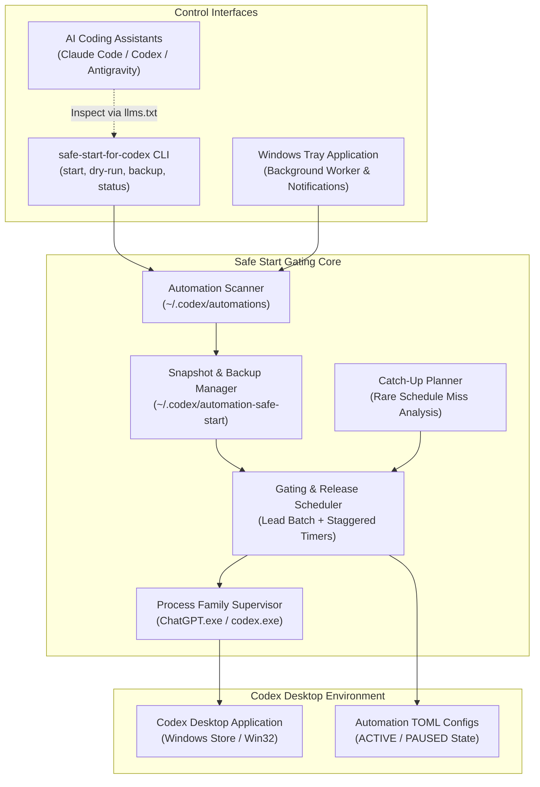
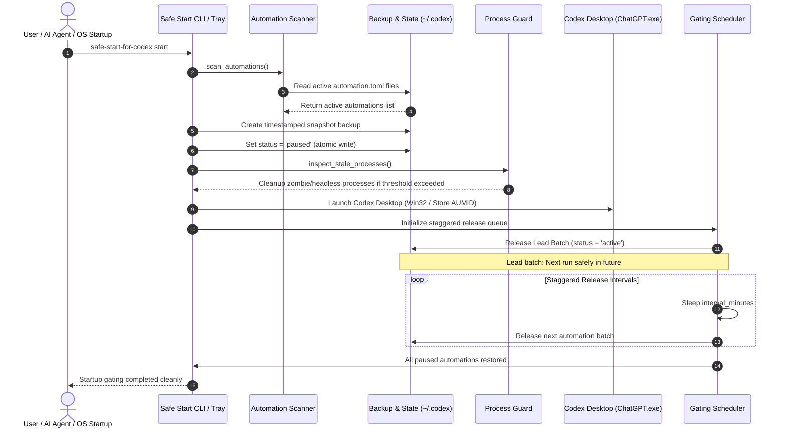

# Safe Start for Codex

Unofficial Windows startup gate for Codex Desktop automations and catch-up pacing.


<p align="center">
  <a href="pyproject.toml"></a>
  <a href="https://github.com/dev-bricks/safe-start-for-codex/actions/workflows/ci.yml"></a>
  <a href="https://github.com/dev-bricks/safe-start-for-codex/actions/workflows/source-platform-smoke.yml"></a>
  <a href="tests/"></a>
  
  
  
  
  <a href="LICENSE"></a>
  <a href="https://github.com/dev-bricks"></a>
  <a href="https://github.com/open-bricks"></a>
  <a href="llms.txt"></a>
</p>

**[English](README.md)** | **[Deutsch](README_de.md)**

> [!NOTE]
> **AI Agent & Codex Automation Integration:** Safe Start for Codex is designed to be inspected, invoked, and verified by local AI coding assistants (Claude Code, Codex CLI, Gemini Antigravity, Kimi). Structured machine-readable context is maintained in [`llms.txt`](llms.txt).

---

### 🧭 Quick Navigation

1. [Overview & Architecture](#1-overview--architecture)
2. [Who It Helps & The Startup Surge Problem](#2-who-it-helps--the-startup-surge-problem)
3. [What Safe Start Does](#3-what-safe-start-does)
4. [System Architecture](#4-system-architecture)
5. [Startup Gating & Release Lifecycle](#5-startup-gating--release-lifecycle)
6. [Governance & Runtime Invariants](#6-governance--runtime-invariants)
7. [CLI Usage & Subcommands](#7-cli-usage--subcommands)
8. [Configuration & Tuning](#8-configuration--tuning)
9. [Windows Tray Mode & Process Supervision](#9-windows-tray-mode--process-supervision)
10. [Conservative Catch-Up Planner](#10-conservative-catch-up-planner)
11. [Upstream Issue Proposal & Solution Concept](#11-upstream-issue-proposal--solution-concept)
12. [Related Tools & Ecosystem](#12-related-tools--ecosystem)
13. [Discovery Context](#13-discovery-context)
14. [Development, Security & License](#14-development-security--license)

---

## 1. Overview & Architecture

Safe Start for Codex is a lightweight Python utility and Windows startup gate designed for developers who run multiple local Codex Desktop automations. When Codex Desktop opens, recurring automations scheduled during system downtime or sleep often trigger simultaneously, causing startup surges, CPU spikes, rate limit exhaustion, and UI lockups.

Safe Start intercepts this behavior cleanly:
1. It takes an atomic snapshot backup of all active automations.
2. It sets active automations to `PAUSED` before launching Codex.
3. It starts Codex Desktop in user mode.
4. It releases a small lead batch whose schedule lies safely in the future.
5. It releases remaining automations gradually in staggered background intervals.

This project is an independent community tool and is not affiliated with, endorsed by, or maintained by OpenAI.

---

## 2. Who It Helps & The Startup Surge Problem

| Challenge | Without Safe Start | With Safe Start for Codex |
|:---|:---|:---|
| **Simultaneous Startup** | All due automations fire instantly upon Codex Desktop boot. | Automations are paused before boot and unpaused in rate-limited batches. |
| **System Load & API Spikes** | CPU, disk, and API quotas surge simultaneously. | Predictable, staggered resource consumption via configurable release delays. |
| **Stale Process Leftovers** | Orphaned `codex.exe` or `ChatGPT.exe` instances linger silently. | Automatic zombie-process supervision with conservative age safeguards. |
| **Configuration Safety** | Manual edits risk TOML syntax or state corruption. | Atomic writes via temporary staging and automated snapshot backups. |
| **Missed Rare Runs** | Infrequent automations (e.g. weekly/monthly) execute haphazardly. | Read-only catch-up planning identifies missed runs without force-running. |

Safe Start is intentionally narrow: it is a local startup gate and safety supervisor, not a replacement scheduler, cloud service, or Codex fork.

---

## 3. What Safe Start Does

- **Automation Scanning:** Detects local Codex automation TOML files under `CODEX_HOME` or `~/.codex/automations`.
- **Pre-Boot Gating:** Pauses automations that were `ACTIVE` at startup to prevent simultaneous execution.
- **Atomic Backup:** Writes a timestamped snapshot of configuration states before making any modifications.
- **Process Guard:** Optionally terminates stale, headless Codex zombie processes exceeding the idle threshold.
- **Clean Launch:** Starts Codex Desktop (supporting both packaged Windows Store AUMID and native Win32 executables).
- **Staggered Release:** Re-enables a lead batch first, followed by staggered releases at defined intervals.
- **Selective Restoration:** Restores only automations that were paused by Safe Start in that session; pre-existing paused automations remain disabled.
- **Catch-Up Planning:** Generates a read-only audit of missed infrequent schedules without triggering manual "Run now" actions.
- **Dual-Platform Portability:** Runs in Windows production with Linux and macOS source parsing and smoke test coverage.

---

## 4. System Architecture



---

## 5. Startup Gating & Release Lifecycle



---

## 6. Governance & Runtime Invariants

Safe Start for Codex enforces 10 strict architectural and runtime invariants:

| # | Invariant | Scope | Guarantee & Verification |
|---|:---|:---|:---|
| 1 | **Local-First & Zero Egress** | Network | 100% offline; zero network calls, telemetry, or remote tracking. All state is host-local. |
| 2 | **Non-Elevation (User-Mode)** | Security | Operates strictly with standard user permissions. Never requests or requires UAC or administrator elevation. |
| 3 | **Snapshot-Before-Mutation** | Data Safety | Creates an atomic backup in `~/.codex/automation-safe-start/backups/` before altering any `automation.toml`. |
| 4 | **Selective Restoration Guard** | Idempotency | Only restores automations paused by Safe Start in that session. Previously disabled automations remain paused. |
| 5 | **Conservative Catch-Up Policy** | Scheduling | Catch-up planning is strictly read-only; never triggers manual "Run now" actions or forces immediate execution. |
| 6 | **Targeted Process Supervision** | OS Processes | Stale process termination is constrained to the recognized Codex process family (`ChatGPT.exe`, `codex.exe`) with zombie age safeguards. |
| 7 | **Atomic TOML Serialization** | Integrity | Configuration and state writes use temporary file staging and atomic renames to prevent corruption on abrupt termination. |
| 8 | **Fail-Closed Diagnostics** | Reliability | Malformed configs or unhandled filesystem states log descriptive errors and halt without modifying active files. |
| 9 | **Dual-Platform Architecture** | Portability | Windows-targeted production execution with multi-OS source parsing smoke tests across Linux and macOS. |
| 10 | **Ecosystem Parity** | Governance | Full metadata, documentation, and contract test alignment with `dev-bricks` and `open-bricks` standards. |

---

## 7. CLI Usage & Subcommands

### Subcommand Overview

| Command | Description |
|:---|:---|
| `safe-start-for-codex dry-run` | Simulates scanning and gating without modifying TOML files. |
| `safe-start-for-codex backup` | Creates a manual snapshot backup of all active configurations. |
| `safe-start-for-codex start` | Launches Codex Desktop and gates automations in the foreground. |
| `safe-start-for-codex tray` | Runs as a background Windows system tray application with desktop toast alerts. |
| `safe-start-for-codex status` | Prints the current state of gated automations and active snapshots. |
| `safe-start-for-codex config-init` | Generates a default `config.json` file. |
| `safe-start-for-codex config-show` | Displays the active configuration and directory paths. |
| `safe-start-for-codex catchup-plan` | Lists missed runs for infrequent/rare automations. |
| `safe-start-for-codex restore-latest` | Emergency command: restores automations paused by the latest snapshot. |

### Common Workflows

```powershell
# 1. Simulate the startup gate safely
safe-start-for-codex dry-run

# 2. Create a manual snapshot backup
safe-start-for-codex backup

# 3. Launch Codex Desktop with gating
safe-start-for-codex start

# 4. Check status of automations
safe-start-for-codex status

# 5. Review missed runs for infrequent automations
safe-start-for-codex catchup-plan
```

---

## 8. Configuration & Tuning

Configuration is stored locally in `~/.codex/automation-safe-start/config.json`:

```json
{
  "initial_release": 3,
  "interval_minutes": 5,
  "startup_delay_seconds": 45,
  "min_future_lead_minutes": 2,
  "launch": true,
  "cleanup": true,
  "catchup_enabled": false,
  "catchup_lookback_days": 30,
  "catchup_max_per_start": 1,
  "catchup_min_period_hours": 24
}
```

### Parameter Reference

- `initial_release` (default: `3`): Number of automations to re-enable in the initial lead batch.
- `interval_minutes` (default: `5`): Delay between successive unpause batches.
- `startup_delay_seconds` (default: `45`): Initial pause after launching Codex before restoring the first batch.
- `min_future_lead_minutes` (default: `2`): Lead threshold ensuring the first batch's next scheduled run is in the future.
- `launch` (default: `true`): Whether Safe Start launches the Codex Desktop application.
- `cleanup` (default: `true`): Whether to audit and clean stale/headless zombie Codex processes.
- `catchup_enabled` (default: `false`): Enables prioritizing rare missed runs into the lead batch.
- `catchup_lookback_days` (default: `30`): Lookback window for detecting missed schedule triggers.
- `catchup_max_per_start` (default: `1`): Maximum number of missed automations prioritized per boot.
- `catchup_min_period_hours` (default: `24`): Recurrence threshold (schedules rarer than daily).

---

## 9. Windows Tray Mode & Process Supervision

For seamless day-to-day operation, Safe Start can run minimized in the Windows System Tray:

```powershell
python -m pip install -e ".[tray]"
safe-start-for-codex tray
```

- **Desktop Notifications:** Reports startup milestones, batch releases, and worker failures as Windows toast notifications.
- **Process Guarding:** Distinguishes between packaged Windows Store installations (`ChatGPT.exe` host with `codex.exe` app-server) and standalone installations.
- **Zombie Safeguards:** Preserves active UI renderers while pruning detached backend processes that exceed idle age thresholds.

---

## 10. Conservative Catch-Up Planner

Codex Desktop may skip automation runs if the computer was turned off or asleep during scheduled execution. Safe Start includes a conservative catch-up analyzer:

```powershell
safe-start-for-codex catchup-plan
```

- **Read-Only Inspection:** Analyzes thread history, schedule recurrences (DAILY, WEEKLY, MONTHLY), and execution timestamps.
- **No Force-Run:** Does not execute Codex's manual "Run now" command.
- **Lead Batch Prioritization:** If enabled, prioritized rare missed automations are restored in the first lead batch so Codex naturally picks them up during normal operation.

---

## 11. Upstream Issue Proposal & Solution Concept

This project serves as an external solution and architectural reference for native improvements inside Codex Desktop:

- [Upstream Issue Draft](docs/UPSTREAM_ISSUE_PROPOSAL.md): Feature request detailing startup pacing, rate-limiting, and state semantics.
- [Solution Concept](docs/SOLUTION_CONCEPT.md): Technical outline for implementing native automation catch-up and gating directly inside the Codex desktop host.

---

## 12. Related Tools & Ecosystem

Safe Start for Codex integrates with the broader `dev-bricks`, `ellmos-ai`, and `open-bricks` developer tooling ecosystem:

| Repository | Organization | Scope & Focus | Ecosystem Integration |
|:---|:---|:---|:---|
| [CareCenter-for-Codex](https://github.com/dev-bricks/CareCenter-for-Codex) | `dev-bricks` | Maintenance DB & Log Viewer | Reads execution history, automations logs, and diagnostic telemetry from Codex runs. |
| [CodeBox](https://github.com/dev-bricks/CodeBox) | `dev-bricks` | Sandboxed Python Execution | Isolated Python code execution box for testing scripts and automations safely. |
| [companion-for-agy](https://github.com/dev-bricks/companion-for-agy) | `dev-bricks` | Terminal & UI Wrapper | Companion process and UI bridge for Google Antigravity and agent CLI sessions. |
| [automation-master](https://github.com/dev-bricks/automation-master) | `dev-bricks` | Multi-Agent Orchestration | Governance ledger, credit budgeting, and task scheduling across autonomous agents. |
| [WikiStub-Seed](https://github.com/dev-bricks/WikiStub-Seed) | `dev-bricks` | Documentation Seed Generator | Static documentation generator and Markdown knowledge-base bootstrapper. |
| [MethodenAnalyser](https://github.com/dev-bricks/MethodenAnalyser) | `dev-bricks` | Workflow & Structural Analysis | Structural analysis toolkit for multi-agent workflows and cognitive procedures. |
| [lock-master](https://github.com/ellmos-ai/lock-master) | `ellmos-ai` | File & Workspace Locking | Fail-closed distributed concurrency control preventing multi-agent write collisions. |
| [ticket-master](https://github.com/ellmos-ai/ticket-master) | `ellmos-ai` | Structured Task Routing | Queue and ticket management for cross-agent work distribution and triage. |
| [ellmos-filecommander-mcp](https://github.com/ellmos-ai/ellmos-filecommander-mcp) | `ellmos-ai` | Filesystem MCP Server | Fine-grained file operations, process monitoring, and safe deletion for LLM agents. |
| [ellmos-codecommander-mcp](https://github.com/ellmos-ai/ellmos-codecommander-mcp) | `ellmos-ai` | AST & Code Analysis MCP | Code refactoring, import diagnostics, and semantic structural edits for agents. |
| [ellmos-controlcenter-mcp](https://github.com/ellmos-ai/ellmos-controlcenter-mcp) | `ellmos-ai` | MCP Stack Control Plane | Dynamic MCP tool discovery, bundle orchestration, and capability resolution. |
| [open-bricks](https://github.com/open-bricks) | `open-bricks` | Umbrella Ecosystem | Root organization coordinating open-source developer tooling and standards. |

---

## 13. Discovery Context

To precisely distinguish this project from general Codex resources:

```text
safe-start-for-codex
Safe Start for Codex
Codex Desktop automation startup gate
Codex Desktop automation surge prevention
Windows Codex automation scheduler guard
local Codex automation catch-up planner
Codex Desktop recurring automation startup control
```

### Disambiguation

The canonical repository is `dev-bricks/safe-start-for-codex`. It is not OpenAI Codex itself, not an OpenAI fork, and not a replacement task scheduler. Broad web searches for "Codex startup" often collide with generic tutorials, sandboxing articles, or prompt-engineering repositories.

---

## 14. Development, Security & License

### Development Setup

```powershell
# Clone and install in editable mode with development dependencies
python -m pip install -e ".[dev,tray]"

# Run test suite
pytest -v

# Run linting
ruff check .

# Build standalone Windows Tray executable
.\build_exe.bat
```

### Security Policy

- **Reporting:** Please report vulnerabilities via [GitHub Private Vulnerability Reporting](https://github.com/dev-bricks/safe-start-for-codex/security/advisories/new) or by emailing `security@ellmos.ai` and `security@open-bricks.org`.
- **Response SLA:** Reports acknowledged within 48 hours; technical triage completed within 5 business days.
- Full details: [`SECURITY.md`](SECURITY.md).

### License

Distributed under the MIT License. See [`LICENSE`](LICENSE) for complete terms.
Direct third-party dependency licenses are audited in [`THIRD_PARTY_LICENSES.txt`](THIRD_PARTY_LICENSES.txt).

---
*Last checked: 2026-09-08 by MARKETING & DESIGN audit.*
