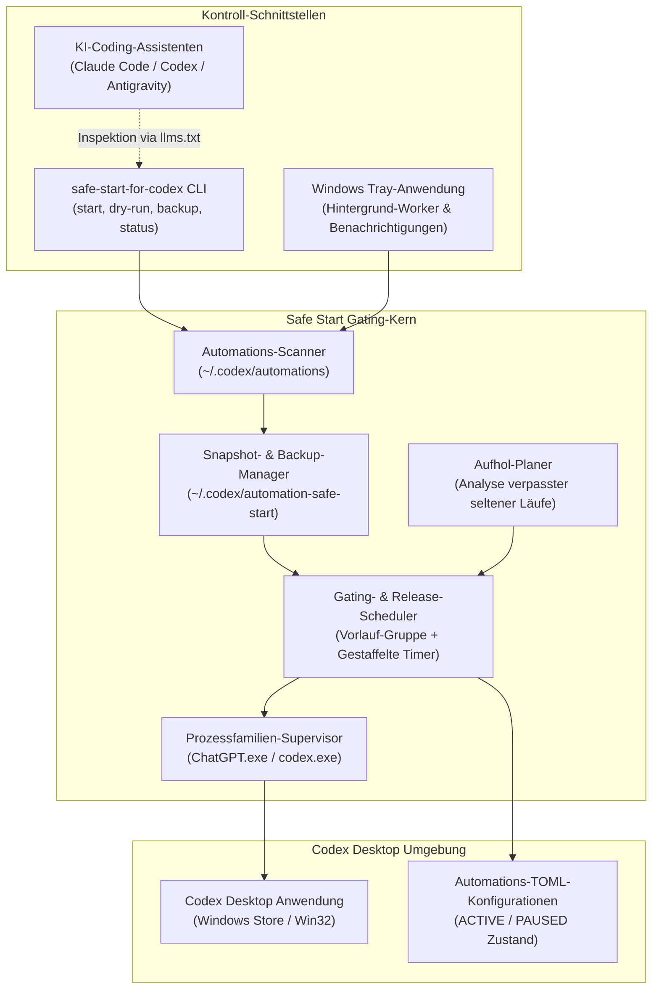
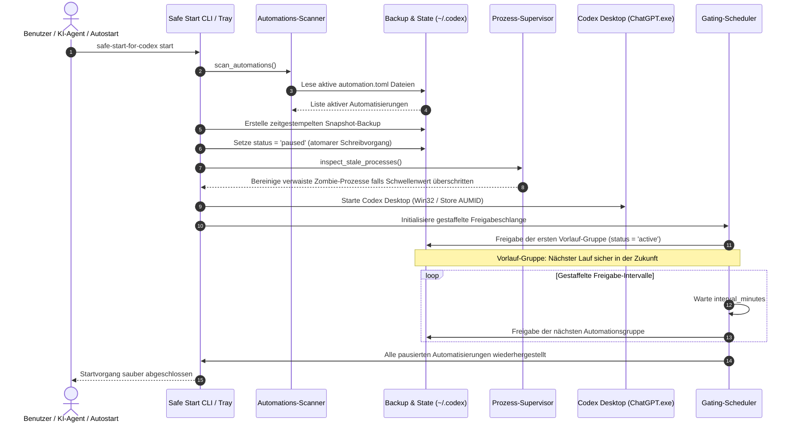

# Safe Start for Codex

Inoffizielles Windows-Startup-Gate für Codex Desktop-Automatisierungen und gestaffelte Ausführung.


<p align="center">
  <a href="pyproject.toml"></a>
  <a href="https://github.com/dev-bricks/safe-start-for-codex/actions/workflows/ci.yml"></a>
  <a href="https://github.com/dev-bricks/safe-start-for-codex/actions/workflows/source-platform-smoke.yml"></a>
  <a href="tests/"></a>
  
  
  
  
  <a href="LICENSE"></a>
  <a href="https://github.com/dev-bricks"></a>
  <a href="https://github.com/open-bricks"></a>
  <a href="llms.txt"></a>
</p>

**[English](README.md)** | **[Deutsch](README_de.md)**

> [!NOTE]
> **Integration für KI-Agenten & Codex-Automatisierung:** Safe Start for Codex ist darauf ausgelegt, von lokalen KI-Coding-Assistenten (Claude Code, Codex CLI, Gemini Antigravity, Kimi) inspiziert, ausgeführt und verifiziert zu werden. Strukturierter, maschinenlesbarer Kontext steht unter [`llms.txt`](llms.txt) zur Verfügung.

---

### 🧭 Schnellnavigation

1. [Übersicht & Systemarchitektur](#1-übersicht--systemarchitektur)
2. [Für wen es gedacht ist & Das Problem der Startspitzen](#2-für-wen-es-gedacht-ist--das-problem-der-startspitzen)
3. [Funktionsweise von Safe Start](#3-funktionsweise-von-safe-start)
4. [Systemarchitektur](#4-systemarchitektur)
5. [Start-Gating & Freigabe-Lebenszyklus](#5-start-gating--freigabe-lebenszyklus)
6. [Governance- & Laufzeitinvarianten](#6-governance--laufzeitinvarianten)
7. [CLI-Nutzung & Unterbefehle](#7-cli-nutzung--unterbefehle)
8. [Konfiguration & Feinabstimmung](#8-konfiguration--feinabstimmung)
9. [Windows Tray-Modus & Prozessüberwachung](#9-windows-tray-modus--prozessüberwachung)
10. [Konservativer Aufholplaner (Catch-Up Planner)](#10-konservativer-aufholplaner-catch-up-planner)
11. [Upstream-Verbesserungsvorschlag & Lösungskonzept](#11-upstream-verbesserungsvorschlag--lösungskonzept)
12. [Verwandte Tools & Ökosystem](#12-verwandte-tools--ökosystem)
13. [Auffindbarkeit](#13-auffindbarkeit)
14. [Entwicklung, Sicherheit & Lizenz](#14-entwicklung-sicherheit--lizenz)

---

## 1. Übersicht & Systemarchitektur

Safe Start for Codex ist ein kompaktes Python-Tool und Windows-Startup-Gate für Entwickler, die mehrere lokale Codex Desktop-Automatisierungen betreiben. Beim Start von Codex Desktop werden wiederkehrende Automatisierungen, die während Ruhephasen oder im Standby fällig wurden, oft gleichzeitig ausgelöst. Dies führt zu Systemüberlastung, CPU-Spitzen, verbrauchten API-Quoten und blockierten Benutzeroberflächen.

Safe Start verhindert dieses Verhalten kontrolliert:
1. Es erstellt vorab ein atomares Snapshot-Backup aller aktiven Konfigurationen.
2. Es versetzt aktive Automatisierungen vor dem Codex-Start in den Zustand `PAUSED`.
3. Es startet Codex Desktop im unprivilegierten Benutzer-Modus.
4. Es reaktiviert eine kleine Vorlauf-Gruppe, deren geplanter Lauf sicher in der Zukunft liegt.
5. Es gibt die verbleibenden Automatisierungen gestaffelt in zeitlichen Intervallen im Hintergrund frei.

Dieses Projekt ist eine unabhängige Open-Source-Entwicklung und steht in keiner Verbindung zu OpenAI.

---

## 2. Für wen es gedacht ist & Das Problem der Startspitzen

| Herausforderung | Ohne Safe Start | Mit Safe Start for Codex |
|:---|:---|:---|
| **Gleichzeitiger Start** | Alle fälligen Automatisierungen starten simultan beim Desktop-Boot. | Automatisierungen werden vor dem Start pausiert und kontrolliert freigegeben. |
| **Lastspitzen & API-Limits** | CPU-, Festplatten- und API-Kontingente werden schlagartig überlastet. | Vorhersehbare, gestaffelte Ressourcennutzung durch einstellbare Freigabe-Intervalle. |
| **Verwaiste Restprozesse** | Zombie-Instanzen von `codex.exe` oder `ChatGPT.exe` verbleiben unbemerkt. | Automatische Prozessüberwachung mit konservativen Schwellenwerten für Zombies. |
| **Konfigurationssicherheit** | Manuelle TOML-Edits bergen Syntaxfehler- und Datenverlustrisiken. | Atomare Schreibvorgänge via Staging-Dateien und automatische Snapshot-Backups. |
| **Verpasste seltene Läufe** | Seltene Automatisierungen (z. B. wöchentlich) laufen unvorhersehbar nach. | Schreibgeschützter Aufholplan analysiert verpasste Läufe ohne erzwungene Ausführung. |

Safe Start ist bewusst fokussiert: Es ist ein lokales Startup-Gate und Sicherheitswächter, kein Ersatz-Scheduler, kein Cloud-Dienst und kein Codex-Fork.

---

## 3. Funktionsweise von Safe Start

- **Automations-Scan:** Erkennt lokale Codex-Automatisierungs-TOML-Dateien unter `CODEX_HOME` oder `~/.codex/automations`.
- **Pre-Boot Gating:** Pausiert beim Start aktive (`ACTIVE`) Automatisierungen zur Vermeidung von Lastspitzen.
- **Atomares Backup:** Schreibt einen zeitgestempelten Snapshot aller Konfigurationen vor jeder Änderung.
- **Prozess-Supervisor:** Beendet optional verwaiste, fensterlose Zombie-Prozesse oberhalb definierter Altersgrenzen.
- **Sauberer Start:** Startet Codex Desktop (unterstützt Windows Store AUMID sowie native Win32-Installationen).
- **Gestaffelte Freigabe:** Aktiviert zuerst eine Vorlauf-Gruppe und reaktiviert den Rest schrittweise nach Zeitintervallen.
- **Selektive Wiederherstellung:** Stellt ausschließlich Automatisierungen wieder her, die vom Tool in dieser Sitzung pausiert wurden; manuell pausierte Einträge bleiben unverändert.
- **Aufhol-Planer:** Erstellt eine schreibgeschützte Übersicht verpasster seltener Läufe ohne manuelle "Run now"-Auslösung.
- **Plattform-Portabilität:** Produktivbetrieb unter Windows mit Linux- und macOS-Source-Smoke-Tests.

---

## 4. Systemarchitektur



---

## 5. Start-Gating & Freigabe-Lebenszyklus



---

## 6. Governance- & Laufzeitinvarianten

Safe Start for Codex erzwingt 10 strikte Architektur- und Laufzeitgarantien:

| # | Invariante | Bereich | Garantie & Überprüfung |
|---|:---|:---|:---|
| 1 | **Local-First & Zero Egress** | Netzwerk | 100% offline; keine Netzwerkaufrufe, keine Telemetrie, kein Tracking. Alle Zustände sind lokal. |
| 2 | **Non-Elevation (User-Mode)** | Sicherheit | Läuft vollständig mit Standard-Benutzerrechten. Erfordert und fordert niemals Administrator-/UAC-Rechte an. |
| 3 | **Snapshot-Before-Mutation** | Datensicherheit | Erstellt ein atomares Backup in `~/.codex/automation-safe-start/backups/` vor jeder Änderung an `automation.toml`. |
| 4 | **Selektive Wiederherstellung** | Idempotenz | Reaktiviert nur Automatisierungen, die Safe Start in der jeweiligen Sitzung pausiert hat. Bereits inaktive bleiben unverändert. |
| 5 | **Konservative Aufholpolitik** | Ablaufplanung | Die Aufholanalyse ist rein schreibgeschützt; sie löst niemals manuelle "Run now"-Aktionen oder Sofortläufe aus. |
| 6 | **Gezielte Prozessüberwachung** | Betriebssystem | Die Bereinigung beschränkt sich strikt auf die Codex-Prozessfamilie (`ChatGPT.exe`, `codex.exe`) mit Altersgrenzen. |
| 7 | **Atomare TOML-Serialisierung** | Integrität | Schreibzugriffe nutzen Staging-Dateien und atomare Umbenennungen gegen Datenverlust bei abruptem Abbruch. |
| 8 | **Fail-Closed Diagnostik** | Zuverlässigkeit | Fehlerhafte Konfigurationen oder Dateizustände brechen kontrolliert ab, ohne Dateien unvollständig zu modifizieren. |
| 9 | **Duale Plattformarchitektur** | Portabilität | Produktiver Einsatz unter Windows mit plattformübergreifenden Smoke-Tests für Linux und macOS. |
| 10 | **Ökosystem-Parität** | Governance | Vollständige Metadaten-, Dokumentations- und Vertragstest-Konformität mit `dev-bricks`- und `open-bricks`-Standards. |

---

## 7. CLI-Nutzung & Unterbefehle

### Unterbefehle im Überblick

| Befehl | Beschreibung |
|:---|:---|
| `safe-start-for-codex dry-run` | Simuliert Scan und Gating ohne Änderungen an TOML-Dateien. |
| `safe-start-for-codex backup` | Erstellt ein manuelles Snapshot-Backup aller aktiven Konfigurationen. |
| `safe-start-for-codex start` | Startet Codex Desktop und steuert Automatisierungen im Vordergrund. |
| `safe-start-for-codex tray` | Startet als Hintergrund-System-Tray-Anwendung mit Windows-Benachrichtigungen. |
| `safe-start-for-codex status` | Zeigt den aktuellen Status der Automatisierungen und Snapshots an. |
| `safe-start-for-codex config-init` | Erzeugt eine Standard-`config.json`-Konfigurationsdatei. |
| `safe-start-for-codex config-show` | Zeigt die aktuell geladene Konfiguration und Pfade an. |
| `safe-start-for-codex catchup-plan` | Listet verpasste Läufe seltener Automatisierungen auf. |
| `safe-start-for-codex restore-latest` | Notfallbefehl: Reaktiviert die vom letzten Snapshot pausierten Automatisierungen. |

### Typische Arbeitsabläufe

```powershell
# 1. Start-Gating gefahrlos simulieren
safe-start-for-codex dry-run

# 2. Manuelles Backup erstellen
safe-start-for-codex backup

# 3. Codex Desktop mit kontrolliertem Gating starten
safe-start-for-codex start

# 4. Status der Automatisierungen abfragen
safe-start-for-codex status

# 5. Verpasste Läufe seltener Automatisierungen prüfen
safe-start-for-codex catchup-plan
```

---

## 8. Konfiguration & Feinabstimmung

Die Konfiguration liegt lokal unter `~/.codex/automation-safe-start/config.json`:

```json
{
  "initial_release": 3,
  "interval_minutes": 5,
  "startup_delay_seconds": 45,
  "min_future_lead_minutes": 2,
  "launch": true,
  "cleanup": true,
  "catchup_enabled": false,
  "catchup_lookback_days": 30,
  "catchup_max_per_start": 1,
  "catchup_min_period_hours": 24
}
```

### Parameter-Referenz

- `initial_release` (Standard: `3`): Anzahl der Automatisierungen in der ersten Vorlauf-Gruppe.
- `interval_minutes` (Standard: `5`): Wartezeit zwischen aufeinanderfolgenden Freigabeschritten.
- `startup_delay_seconds` (Standard: `45`): Pause nach dem Codex-Start vor der ersten Freigabe.
- `min_future_lead_minutes` (Standard: `2`): Vorlaufzeit, die der nächste geplante Lauf der ersten Gruppe in der Zukunft liegen muss.
- `launch` (Standard: `true`): Gibt an, ob Safe Start die Codex Desktop-App startet.
- `cleanup` (Standard: `true`): Prüft und bereinigt verwaiste Zombie-Prozesse von Codex.
- `catchup_enabled` (Standard: `false`): Priorisiert verpasste seltene Läufe in der Vorlauf-Gruppe.
- `catchup_lookback_days` (Standard: `30`): Rückblickzeitraum zur Erkennung verpasster Ausführungen.
- `catchup_max_per_start` (Standard: `1`): Maximale Anzahl priorisierter Aufhol-Läufe pro Start.
- `catchup_min_period_hours` (Standard: `24`): Wiederholungsschwelle (nur Zeitpläne seltener als täglich).

---

## 9. Windows Tray-Modus & Prozessüberwachung

Für den unauffälligen Alltagsbetrieb kann Safe Start im Windows System-Tray minimiert laufen:

```powershell
python -m pip install -e ".[tray]"
safe-start-for-codex tray
```

- **Desktop-Benachrichtigungen:** Informiert über Startfortschritt, Batch-Freigaben und Hintergrundfehler via Windows Toast Notifications.
- **Prozess-Supervisor:** Erkennt Windows Store Installationen (`ChatGPT.exe` Host mit `codex.exe` App-Server) sowie native Installationen.
- **Zombie-Schutz:** Erhält aktive UI-Fenster und bereinigt nur abgetrennte Hintergrundprozesse oberhalb definierter Leerlaufgrenzen.

---

## 10. Konservativer Aufholplaner (Catch-Up Planner)

Wenn der Computer während geplanter Automatisierungszeiten ausgeschaltet oder im Energiesparmodus war, können Läufe verpasst werden. Safe Start bietet einen konservativen Aufholplaner:

```powershell
safe-start-for-codex catchup-plan
```

- **Schreibgeschützte Analyse:** Liest Thread-Historien, Recurrence-Muster (DAILY, WEEKLY, MONTHLY) und Zeitstempel.
- **Keine Zwangsausführung:** Führt keine manuelle "Run now"-Aktion in Codex aus.
- **Vorlauf-Priorisierung:** Bei aktiviertem Feature werden verpasste seltene Läufe in die Vorlauf-Gruppe einsortiert, sodass Codex sie regulär und ohne Überlastung abarbeitet.

---

## 11. Upstream-Verbesserungsvorschlag & Lösungskonzept

Dieses Tool dient auch als externe Referenz und Lösungsvorschlag für native Optimierungen innerhalb von Codex Desktop:

- [Upstream Issue Draft](docs/UPSTREAM_ISSUE_PROPOSAL.md): Feature-Request mit detaillierter Beschreibung des Startup-Pacings, Rate-Limitings und Zustandsmanagements.
- [Solution Concept](docs/SOLUTION_CONCEPT.md): Technischer Lösungsentwurf zur nativen Integration des Automations-Gatings direkt in den Codex-Host.

---

## 12. Verwandte Tools & Ökosystem

Safe Start for Codex arbeitet nahtlos im Ökosystem von `dev-bricks`, `ellmos-ai` und `open-bricks`:

| Repository | Organisation | Bereich & Fokus | Ökosystem-Integration |
|:---|:---|:---|:---|
| [CareCenter-for-Codex](https://github.com/dev-bricks/CareCenter-for-Codex) | `dev-bricks` | Wartungs-DB & Log-Viewer | Liest Ausführungshistorien, Automations-Logs und Telemetrie aus Codex-Läufen. |
| [CodeBox](https://github.com/dev-bricks/CodeBox) | `dev-bricks` | Isolierte Python-Ausführung | Sichere Sandbox-Umgebung zum gefahrlosen Testen von Skripten und Automatisierungen. |
| [companion-for-agy](https://github.com/dev-bricks/companion-for-agy) | `dev-bricks` | Terminal- & UI-Brücke | Begleitprozess und UI-Helfer für Google Antigravity und Agenten-CLI-Sitzungen. |
| [automation-master](https://github.com/dev-bricks/automation-master) | `dev-bricks` | Multi-Agenten-Orchestrierung | Governance-Ledger, Credit-Budgetierung und Aufgabenplanung für KI-Agenten. |
| [WikiStub-Seed](https://github.com/dev-bricks/WikiStub-Seed) | `dev-bricks` | Dokumentations-Generator | Statischer Dokumentations-Generator und Markdown-Wissensnetz-Bootstrapper. |
| [MethodenAnalyser](https://github.com/dev-bricks/MethodenAnalyser) | `dev-bricks` | Workflow- & Strukturanalyse | Werkzeugsatz zur strukturellen Analyse von Multi-Agenten-Abläufen. |
| [lock-master](https://github.com/ellmos-ai/lock-master) | `ellmos-ai` | Datei- & Workspace-Locking | Ausfallsichere Concurrency-Steuerung gegen gleichzeitige Schreibkollisionen. |
| [ticket-master](https://github.com/ellmos-ai/ticket-master) | `ellmos-ai` | Strukturierte Aufgabenverteilung | Warteschlangen- und Ticket-Management für agentenübergreifende Aufgaben. |
| [ellmos-filecommander-mcp](https://github.com/ellmos-ai/ellmos-filecommander-mcp) | `ellmos-ai` | Dateisystem MCP-Server | Detaillierte Dateioperationen, Prozessüberwachung und sicheres Löschen für Agenten. |
| [ellmos-codecommander-mcp](https://github.com/ellmos-ai/ellmos-codecommander-mcp) | `ellmos-ai` | AST- & Code-Analyse MCP | Code-Refactoring, Import-Diagnose und semantische Strukturprüfungen für LLMs. |
| [ellmos-controlcenter-mcp](https://github.com/ellmos-ai/ellmos-controlcenter-mcp) | `ellmos-ai` | MCP-Stack Steuerungsebene | Dynamische MCP-Werkzeugerkennung, Bundle-Orchestrierung und Rechtesteuerung. |
| [open-bricks](https://github.com/open-bricks) | `open-bricks` | Dachorganisation | Koordiniert Open-Source-Entwicklerwerkzeuge und Architektur-Standards. |

---

## 13. Auffindbarkeit

Suchbegriffe, die dieses Projekt eindeutig beschreiben:

```text
safe-start-for-codex
Safe Start for Codex
Codex Desktop automation startup gate
Codex Desktop automation surge prevention
Windows Codex automation scheduler guard
local Codex automation catch-up planner
Codex Desktop recurring automation startup control
```

### Abgrenzung & Disambiguierung

Das kanonische Repository ist `dev-bricks/safe-start-for-codex`. Es ist weder OpenAI Codex selbst noch ein Codex-Fork oder allgemeiner Task-Scheduler. Allgemeine Websuchen nach "Codex Startup" führen häufig zu OpenAI-Tutorials, Sandboxing-Artikeln oder unpassenden Prompt-Repositories.

---

## 14. Entwicklung, Sicherheit & Lizenz

### Entwicklungsumgebung

```powershell
# Klonen und im Entwicklungsmodus mit Abhängigkeiten installieren
python -m pip install -e ".[dev,tray]"

# Testsuite ausführen
pytest -v

# Linter prüfen
ruff check .

# Windows Tray-Executable erstellen
.\build_exe.bat
```

### Sicherheitsrichtlinie

- **Meldung:** Bitte melden Sie Sicherheitslücken über [GitHub Private Vulnerability Reporting](https://github.com/dev-bricks/safe-start-for-codex/security/advisories/new) oder per E-Mail an `security@ellmos.ai` und `security@open-bricks.org`.
- **Reaktionszeit:** Eingang wird innerhalb von 48 Stunden bestätigt; technische Triage erfolgt innerhalb von 5 Werktagen.
- Vollständige Richtlinie: [`SECURITY.md`](SECURITY.md).

### Lizenz

Veröffentlicht unter der MIT-Lizenz. Vollständige Lizenzbedingungen siehe [`LICENSE`](LICENSE).
Lizenzen direkter Abhängigkeiten sind in [`THIRD_PARTY_LICENSES.txt`](THIRD_PARTY_LICENSES.txt) dokumentiert.

---
*Zuletzt geprüft: 2026-09-08 im Rahmen des MARKETING & DESIGN Audits.*
