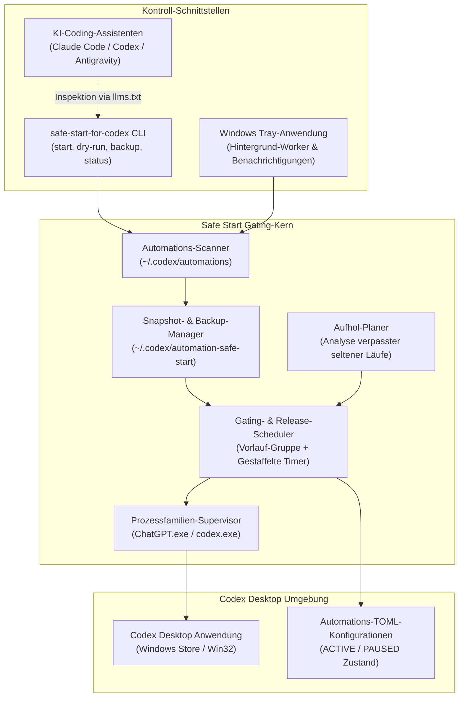
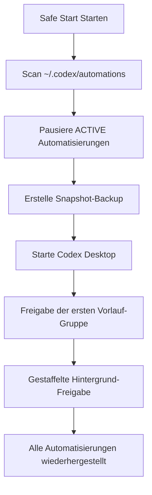

# Safe Start for Codex

Inoffizielles Windows-Startup-Gate für Codex Desktop-Automatisierungen.

[](README.md)
[](pyproject.toml)
[](https://github.com/dev-bricks/safe-start-for-codex/actions/workflows/ci.yml)
[](https://github.com/dev-bricks/safe-start-for-codex/actions/workflows/source-platform-smoke.yml)
[](https://docs.pytest.org/)
[](https://www.python.org/)
[](LICENSE)
[](https://github.com/dev-bricks)
[](https://github.com/open-bricks)
[](llms.txt)

> [!NOTE]
> **Integration für KI-Agenten & Codex-Automatisierung:** Safe Start for Codex ist darauf ausgelegt, von lokalen KI-Assistenten (Claude Code, Codex CLI, Gemini Antigravity) analysiert und ausgeführt zu werden. Maschinenlesbarer Kontext steht unter [`llms.txt`](llms.txt) zur Verfügung.

Safe Start for Codex ist ein kompaktes Python-Tool für Entwickler, die viele lokale Codex-Automatisierungen ausführen und Spitzenlasten (Surges) beim Starten der App vermeiden möchten. Es pausiert vorübergehend aktive lokale Automatisierungen, startet Codex Desktop und gibt sie anschließend kontrolliert und zeitlich gestaffelt wieder frei.

*Dieses Projekt steht in keiner Verbindung zu OpenAI, wird nicht von OpenAI unterstützt oder gepflegt.*

Der Tray-Modus meldet Start- und Hintergrundfehler über lokale Logs und Desktop-Benachrichtigungen, damit Konfigurationsfehler nicht still im Hintergrund verschwinden.

## Systemarchitektur



## Für wen es gedacht ist

Safe Start for Codex richtet sich an Nutzer, die Codex Desktop unter Windows mit vielen lokalen wiederkehrenden Automatisierungen, Erinnerungen, Monitoren oder Hintergrundprüfungen verwenden und einen vorhersehbaren Startpfad brauchen. Das Projekt ist bewusst eng gefasst: Es ist ein lokales Startup-Gate für Automatisierungen, kein Ersatz-Scheduler, kein Cloud-Dienst und kein Codex-Fork.

## Funktionsweise

- Scannt lokale Codex-Automatisierungs-TOML-Dateien unter `CODEX_HOME` oder `~/.codex`.
- Pausiert Automatisierungen, die zum Startzeitpunkt aktiv (`ACTIVE`) waren.
- Startet Codex Desktop auf Windows.
- Gibt eine erste kleine Gruppe frei, deren nächster Lauf sicher in der Zukunft liegt.
- Reaktiviert die verbleibenden Automatisierungen schrittweise (gestaffelt).
- Stellt ausschließlich Automatisierungen wieder her, die vom Tool pausiert wurden.
- Bereinigt optional verwaiste Codex-Startreste auf Windows (z. B. alte Hauptprozesse ohne Renderer, verwaiste Lockfiles).
- Kann einen schreibgeschützten Aufholplan (Catch-Up Plan) für selten ausgeführte Automatisierungen erstellen, die einen Lauf verpasst haben.
- Enthält Windows-CI sowie Source-Platform-Smoke-Checks für macOS- und Linux-Parsing-/Konfigurationslogik.



Das Tool aktiviert keine Automatisierungen, die bereits vor dem Start manuell pausiert waren, und löst keine manuelle Ausführung ("Run now") in Codex aus.

## Sicherheitshinweis

Dies ist ein Workaround um das lokale Startverhalten von Codex Desktop. Das Tool bearbeitet Dateien unter `~/.codex/automations/*/automation.toml`, erstellt Snapshots in `~/.codex/automation-safe-start` und beendet ggf. verwaiste Codex-Prozesse.

Führen Sie vor der ersten echten Nutzung einen Testlauf aus:

```powershell
safe-start-for-codex dry-run
```

Erstellen Sie ein Backup:

```powershell
safe-start-for-codex backup
```

## Installation

Aus einem lokalen Klon:

```powershell
python -m pip install -e .
```

Für den optionalen System-Tray-Modus:

```powershell
python -m pip install -e ".[tray]"
```

## Nutzung

| Befehl | Beschreibung |
|---|---|
| `safe-start-for-codex dry-run` | Simuliert das Scannen und Pausieren, ohne Dateien zu ändern. |
| `safe-start-for-codex backup` | Erstellt ein Backup aller aktiven Automations-Konfigurationen. |
| `safe-start-for-codex start` | Startet Codex Desktop und steuert die Freigabe im Vordergrund. |
| `safe-start-for-codex tray` | Startet als Hintergrund-Anwendung im Windows System-Tray. |
| `safe-start-for-codex status` | Zeigt den aktuellen Zustand der gesteuerten Automatisierungen. |
| `safe-start-for-codex config-init` | Erstellt eine Standard-Konfiguration (`config.json`). |
| `safe-start-for-codex config-show` | Zeigt die aktuell geladene Konfiguration an. |
| `safe-start-for-codex catchup-plan` | Zeigt verpasste Läufe für seltene Automatisierungen an. |
| `safe-start-for-codex restore-latest` | Erzwingt die Wiederherstellung aller zuletzt pausierten Automatisierungen. |

## Konfiguration

Standardmäßig liest das Tool die Konfiguration unter:

```text
~/.codex/automation-safe-start/config.json
```

Beispiel:

```json
{
  "initial_release": 3,
  "interval_minutes": 5,
  "startup_delay_seconds": 45,
  "min_future_lead_minutes": 2,
  "launch": true,
  "cleanup": true,
  "catchup_enabled": false,
  "catchup_lookback_days": 30,
  "catchup_max_per_start": 1,
  "catchup_min_period_hours": 24
}
```

- `initial_release`, `interval_minutes` und `startup_delay_seconds` steuern die Anzahl der sofort reaktivierten Automatisierungen, die Wartezeit zwischen weiteren Freigaben und die Verzögerung nach dem Codex-Start.
- Wenn `catchup_enabled` auf `true` gesetzt ist, analysiert Safe Start die Ausführungshistorie und priorisiert bis zu `catchup_max_per_start` seltene, verpasste Automatisierungen für eine frühere Reaktivierung (Schwellenwert gesteuert durch `catchup_min_period_hours`).

## Upstream-Vorschlag

Dieser Workaround existiert, weil das Problem idealerweise nativ in Codex gelöst werden sollte. Siehe dazu:

- [Upstream-Issue-Entwurf (Englisch)](docs/UPSTREAM_ISSUE_PROPOSAL.md)
- [Lösungskonzept (Englisch)](docs/SOLUTION_CONCEPT.md)

## Auffindbarkeit

Präzise Suchphrasen für dieses Repository:

```text
safe-start-for-codex
Safe Start for Codex
Codex Desktop automation startup gate
Codex Desktop automation surge prevention
Windows Codex automation scheduler guard
local Codex automation catch-up planner
```

Der exakte Repository-Pfad lautet `dev-bricks/safe-start-for-codex`. Breite Suchen nach "Codex startup" oder "automation gate" kollidieren häufig mit allgemeinen OpenAI-Codex-Tutorials, Sandbox-Artikeln und fremden GitHub-Projekten.

## Entwicklung

```powershell
python -m pip install -e ".[dev]"
pytest
```

Kompilieren der Tray-EXE:

```powershell
.\build_exe.bat
```

## Verwandte Tools & Ökosystem

- [CareCenter-for-Codex](https://github.com/dev-bricks/CareCenter-for-Codex): Wartungs-Datenbank und Log-Viewer für Codex CLI und Desktop.
- [CodeBox](https://github.com/dev-bricks/CodeBox): Isolierte Python-Codeausführungsumgebung.
- [companion-for-agy](https://github.com/dev-bricks/companion-for-agy): Terminal-Wrapper & UI-Helfer für Antigravity.
- [automation-master](https://github.com/dev-bricks/automation-master): Multi-Agent-Budgetierung, Governance-Ledger & Ausführungs-Orchestrierung.
- [WikiStub-Seed](https://github.com/dev-bricks/WikiStub-Seed): Seed-Dokumentation & statischer Webseiten-Generator.
- [MethodenAnalyser](https://github.com/dev-bricks/MethodenAnalyser): Methoden- und Strukturanalyse-Toolkit für Multi-Agenten-Workflows.
- [ellmos-filecommander-mcp](https://github.com/ellmos-ai/ellmos-filecommander-mcp): Dateisystem- und Prozess-Orchestrierungs-MCP-Server.
- [ellmos-codecommander-mcp](https://github.com/ellmos-ai/ellmos-codecommander-mcp): Code-Analyse und AST-Verarbeitung.
- [ellmos-controlcenter-mcp](https://github.com/ellmos-ai/ellmos-controlcenter-mcp): MCP-Stack-Steuerungsebene.

## Lizenz

MIT-Lizenz. Siehe [LICENSE](LICENSE).

Die direkten Drittanbieter-Abhängigkeiten und ihre Lizenz-Metadaten sind in
[THIRD_PARTY_LICENSES.txt](THIRD_PARTY_LICENSES.txt) dokumentiert.

---
*Zuletzt geprüft: 2026-08-16 durch den technischen Hygiene- und Auffindbarkeits-Audit (Pfad B).*
