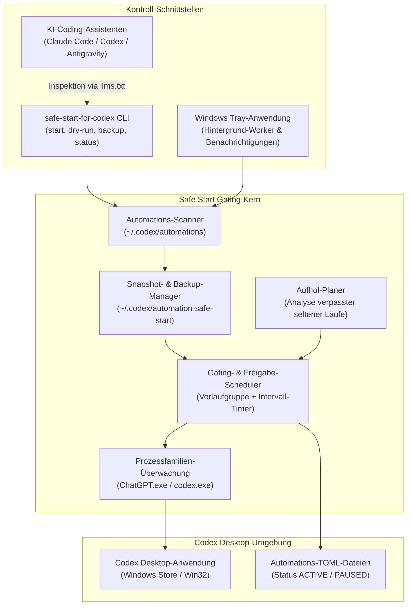
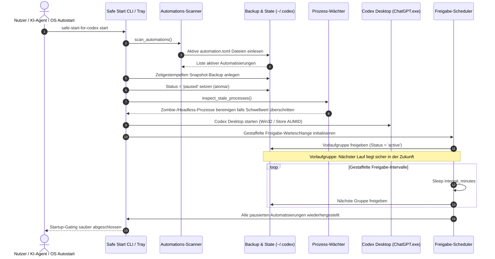

# Safe Start for Codex

Inoffizielles Windows-Startup-Gate für Codex Desktop-Automatisierungen und gestaffelte Ausführung.

<p align="center">
  
</p>

<p align="center">
  <a href="pyproject.toml"></a>
  <a href="NOTICE"></a>
  <a href="https://github.com/dev-bricks/safe-start-for-codex/actions/workflows/ci.yml"></a>
  <a href="https://github.com/dev-bricks/safe-start-for-codex/actions/workflows/source-platform-smoke.yml"></a>
  <a href="tests/"></a>
  
  
  
  
  <a href="SECURITY.md"></a>
  <a href="THIRD_PARTY_LICENSES.md"></a>
  <a href="CHANGELOG.md"></a>
  <a href="MARKETING-LOG.txt"></a>
  <a href="LICENSE"></a>
  <a href="https://github.com/dev-bricks"></a>
  <a href="https://github.com/open-bricks"></a>
  <a href="llms.txt"></a>
</p>

**[English](README.md)** | **[Deutsch](README_de.md)**

> [!NOTE]
> **Integration für KI-Agenten & Codex-Automatisierung:** Safe Start for Codex ist darauf ausgelegt, von lokalen KI-Coding-Assistenten (Claude Code, Codex CLI, Gemini Antigravity, Kimi) inspiziert, ausgeführt und verifiziert zu werden. Strukturierter, maschinenlesbarer Kontext steht unter [`llms.txt`](llms.txt) zur Verfügung.

---

### 🧭 Schnellnavigation

1. [Warum & Problemstellung](#sec-01)
2. [Architektur & Systemfluss](#sec-02)
3. [Vollständiger Lebenszyklus-Ablauf](#sec-03)
4. [Kernfähigkeiten, Governance- & Laufzeitinvarianten](#sec-04)
5. [Zielgruppen & Auffindbarkeit](#sec-05)
6. [Vergleichsmatrix & Alternativen](#sec-06)
7. [Geschwisterwerkzeuge & Partner-Ökosystem](#sec-07)
8. [Funktionsumfang & Kernfähigkeiten](#sec-08)
9. [Visuelle Architektur & Branding](#sec-09)
10. [Systemanforderungen & Plattformmatrix](#sec-10)
11. [Installation & Schnelleinrichtung](#sec-11)
12. [CLI-Nutzung & Befehlsreferenz](#sec-12)
13. [Konfiguration & Feineinstellung](#sec-13)
14. [Konservativer Aufholplaner & Upstream-Vorschlag](#sec-14)
15. [Windows Tray-Modus & Prozessüberwachung](#sec-15)
16. [Drittanbieter-Lizenzen & Level-1-SBOM](#sec-16)
17. [Entwicklung, Qualitätssicherung & Lizenz](#sec-17)
18. [Gesetzlicher Hinweis (§ 521 BGB) & Haftungsausschluss](#sec-18)

---

<a id="sec-01"></a><a id="why--problem-statement"></a><a id="warum--problemstellung"></a>
## 1. Warum & Problemstellung

Safe Start for Codex ist ein kompaktes Python-Tool und Windows-Startup-Gate für Entwickler und KI-Ingenieure, die mehrere lokale Codex Desktop-Automatisierungen betreiben. Beim Start von Codex Desktop werden wiederkehrende Automatisierungen, die während Ruhephasen, im Standby oder nach Systemneustarts fällig wurden, oft gleichzeitig ausgelöst. Dies führt zu schlagartigen Startspitzen, CPU-Drosselung, Festplattensättigung, sofortigem Verbrauch von API-Quoten und blockierten Benutzeroberflächen.

| Herausforderung ohne Safe Start | Auswirkung auf die Entwickler-Workstation | Lösung durch Safe Start for Codex |
|:---|:---|:---|
| **Gleichzeitiger Startsturm** | Alle fälligen Automatisierungen starten simultan beim Desktop-Boot | Automatisierungen werden vorab pausiert und kontrolliert freigegeben |
| **Lastspitzen & API-Limits** | CPU, Festplatte und API-Kontingente werden schlagartig überlastet | Vorhersehbare Ressourcennutzung durch einstellbare Freigabe-Intervalle |
| **Verwaiste Restprozesse** | Zombie-Instanzen von `codex.exe` oder `ChatGPT.exe` verbleiben unbemerkt | Automatische Prozessüberwachung mit konservativen Schwellenwerten für Zombies |
| **Konfigurations-Mutationsrisiken** | Manuelle TOML-Edits bergen Syntaxfehler- und Datenverlustrisiken | Atomare Schreibvorgänge via Staging-Dateien und automatische Snapshot-Backups |
| **Verpasste seltene Läufe** | Seltene Automatisierungen (z. B. wöchentlich) laufen unvorhersehbar nach | Schreibgeschützter Aufholplan analysiert verpasste Läufe ohne erzwungene Ausführung |

Safe Start verhindert dieses Verhalten kontrolliert:
1. Es erstellt vorab ein atomares Snapshot-Backup aller aktiven Konfigurationen, bevor Dateien berührt werden.
2. Es versetzt aktive Automatisierungen vor dem Codex-Start in den Zustand `PAUSED`.
3. Es startet Codex Desktop sauber im unprivilegierten Benutzer-Modus (`RunAsInvoker`).
4. Es reaktiviert eine kleine Vorlauf-Gruppe, deren geplanter Lauf sicher in der Zukunft liegt.
5. Es gibt die verbleibenden Automatisierungen gestaffelt in zeitlichen Intervallen im Hintergrund frei.

Dieses Projekt ist eine unabhängige Open-Source-Entwicklung und steht in keiner Verbindung zu OpenAI.

---

<a id="sec-02"></a><a id="architecture--system-flow"></a><a id="architektur--systemfluss"></a>
## 2. Architektur & Systemfluss



---

<a id="sec-03"></a><a id="complete-lifecycle-sequence"></a><a id="vollstaendiger-lebenszyklus-ablauf"></a><a id="vollständiger-lebenszyklus-ablauf"></a>
## 3. Vollständiger Lebenszyklus-Ablauf



---

<a id="sec-04"></a><a id="key-capabilities--safety-invariants"></a><a id="kernfaehigkeiten--sicherheitsinvarianten"></a>
## 4. Kernfähigkeiten, Governance- & Laufzeitinvarianten

Safe Start for Codex garantiert 10 strikte Architektur- und Laufzeitinvarianten:

| # | Invarianten-ID | Garantiemerkmal | Bereich | Garantie & Verifikation |
|---|:---|:---|:---|:---|
| 1 | `INV-LOCAL-01` | **Local-First & Zero Egress** | Netzwerk | 100% offline; keine Netzwerkaufrufe, keine Telemetrie, kein Tracking. Alle Daten verbleiben lokal. |
| 2 | `INV-SEC-02` | **Keine Elevation (Benutzermodus)** | Sicherheit | Läuft ausschließlich mit Standard-Benutzerrechten (`RunAsInvoker`). Benötigt und fordert niemals Administratorrechte oder UAC an. |
| 3 | `INV-FILE-03` | **Snapshot vor Mutation** | Datensicherheit | Erstellt ein atomares Backup in `~/.codex/automation-safe-start/backups/`, bevor Konfigurationen geändert werden. |
| 4 | `INV-RESTORE-04` | **Selektive Wiederherstellung** | Idempotenz | Reaktiviert nur Automatisierungen, die von Safe Start in dieser Sitzung pausiert wurden; zuvor deaktivierte bleiben pausiert. |
| 5 | `INV-CATCH-05` | **Konservative Aufhol-Richtlinie** | Pacing | Aufholanalyse ist rein lesend; führt niemals eigenständig "Run now" aus und erzwingt keine Sofortstarts. |
| 6 | `INV-PROC-06` | **Gezielte Prozess-Überwachung** | OS-Prozesse | Prozessbereinigung ist auf Codex-spezifische Namen (`ChatGPT.exe`, `codex.exe`) mit konservativen Altersgrenzen beschränkt. |
| 7 | `INV-INTEG-07` | **Atomare TOML-Serialisierung** | Integrität | Dateiänderungen nutzen temporäres Staging und atomares Umbenennen zur Vermeidung von Teilzuständen. |
| 8 | `INV-FAIL-08` | **Fail-Closed Diagnose** | Zuverlässigkeit | Ungültige Konfigurationen oder Dateisystemfehler brechen sicher ab, ohne Produktivdateien unvollständig zu verändern. |
| 9 | `INV-PLAT-09` | **Plattformübergreifende Parität** | Portabilität | Windows-Produktionsfokus ergänzt um Multi-OS Quelltext-Smoke-Tests für Linux und macOS in der CI. |
| 10 | `INV-SLA-10` | **Sicherheits-Reaktions-SLA** | Governance | 48-Stunden-Rückmelde- und 5-Werktage-Triage-Garantie über offizielle Sicherheitskanäle. |

---

<a id="sec-05"></a><a id="target-personas--discoverability"></a><a id="zielgruppen--auffindbarkeit"></a>
## 5. Zielgruppen & Auffindbarkeit

Safe Start for Codex ist auf spezifische Workflows von Entwicklern und Operatoren zugeschnitten:

### Zielgruppen

- **`[PERSONA-01]` Windows Codex Desktop Power-User & Prompt-Entwickler:** Betreiben Dutzende wiederkehrender Automatisierungen und Morgen-Briefings, ohne nach System-Resume von CPU-Spitzen, Rate-Limits oder UI-Freezes ausgebremst zu werden.
- **`[PERSONA-02]` Autonome Multi-Agenten-Schwarm-Betreiber:** Koordinieren lokale Agentensysteme (Claude Code, Codex CLI, Gemini Antigravity, Kimi), bei denen Hintergrundaufgaben deterministisch starten müssen, ohne verwaiste Zombie-Prozesse zu hinterlassen.
- **`[PERSONA-03]` DevOps & System Reliability Engineers (SREs):** Benötigen garantierte Konfigurationssicherheit, Snapshot-Backups vor jeder Dateiänderung und reproduzierbare Startup-Reihenfolgen auf Entwickler-Workstations.
- **`[PERSONA-04]` Enterprise-Sicherheits- & Compliance-Auditoren:** Verlangen streng unprivilegierte Ausführung (`RunAsInvoker`), 100% Zero-Egress ohne Netzwerkverkehr und lückenlos geprüfte, freie Open-Source-Lizenzen.

### Suchbegriffe & Auffindbarkeit
- `safe-start-for-codex` / `Safe Start for Codex`
- `codex desktop automation startup gate`
- `prevent codex desktop startup surge`
- `windows codex automation scheduler guard`
- `staggered release codex automations python`
- `codex automation catch-up planner offline`
- `codex zombie process cleanup python`
- `dev-bricks safe start for codex`
- `local-first zero-egress codex gate`

### Abgrenzung & Positionierung
Das kanonische Repository ist `dev-bricks/safe-start-for-codex`. Es ist weder OpenAI Codex selbst noch ein Fork oder Ersatz für Scheduler. Allgemeine Suchen nach "Codex Startup" kollidieren häufig mit Tutorials oder Prompt-Sammlungen. Safe Start liefert:
- **Atomares Pre-Boot-Gating:** Pausiert aktive Automatisierungen, bevor die Desktop-App geladen wird.
- **Vorlauf-Priorisierung:** Reaktiviert sofort Aufgaben, deren Fälligkeit sicher in der Zukunft liegt.
- **Gestaffelte Hintergrund-Timer:** Schaltet verbleibende Aufgaben schrittweise nach Intervall frei.
- **Zero-Egress Sicherheitsgarantie:** Vollständige Privatsphäre ohne jegliche Netzwerkanbindung.

Weitere Details und Vergleiche sind in [`MARKETING-LOG.txt`](MARKETING-LOG.txt) dokumentiert.

---

<a id="sec-06"></a><a id="comparative-matrix--alternatives"></a><a id="vergleichsmatrix--alternativen"></a>
## 6. Vergleichsmatrix & Alternativen

Die folgende 10-Dimensionen-Matrix vergleicht `safe-start-for-codex` mit nativer Ausführung und typischen administrativen Behelfslösungen:

| Dimension / Sicherheitsanforderung | Invarianten-Code | Natives Unmodifiziertes Codex | Windows Aufgabenplanung (`schtasks`) | Eigene Batch- / PowerShell-Skripte | Schwere Enterprise-APM-Agenten | Safe Start for Codex |
|:---|:---:|:---:|:---:|:---:|:---:|:---:|
| **Local-First & Zero-Egress** | `INV-LOCAL-01` | Ja (lokale App) | Ja (OS-nativ) | Ja (lokales Skript) | Nein (Cloud-Telemetrie) | **Ja (100% Zero-Egress, offline)** |
| **Unprivilegierte Ausführung (RunAsInvoker)** | `INV-SEC-02` | Ja (Benutzer-Space) | Erfordert oft SYSTEM/Admin | Variiert (oft Elevation) | Erfordert Admin/Kernel-Treiber | **Ja (reiner Benutzermodus, 0 UAC)** |
| **Snapshot-Vor-Mutation** | `INV-FILE-03` | Nein (direktes Überschreiben) | Nein (keine) | Selten implementiert | Variiert | **Ja (atomare Pre-Boot-Snapshots)** |
| **Selektive Wiederherstellung (Idempotenz)** | `INV-RESTORE-04` | Nein | Nein (binärer Trigger) | Nein (blindes Umschalten) | Nein | **Ja (reaktiviert nur sitzungspausierte)** |
| **Konservatives Aufhol-Pacing** | `INV-CATCH-05` | Überlastet oder überspringt | Startet simultan | Kennt Zeitplan nicht | Externe Warteschlange | **Ja (gestaffelte Freigabe, schreibgeschützt)** |
| **Gezielte Zombie-Überwachung** | `INV-PROC-06` | Keine (hinterlässt Waisen) | Keine | Riskantes `taskkill /f` | Prozessbaum-Überwachung | **Ja (fenster- & renderer-bewusste Hygiene)** |
| **Atomare Konfigurations-Serialisierung** | `INV-INTEG-07` | Partiell | N/A | Hohes Korruptionsrisiko | Proprietary Agent | **Ja (Staging-Datei + atomarer Rename)** |
| **Fail-Closed Diagnose-Schutz** | `INV-FAIL-08` | Stille Fehler | Aufgaben-Fehlercode | Stiller Abbruch | Telemetrie-Alarm | **Ja (Fail-Closed, 0 Mutation bei Fehler)** |
| **Plattformübergreifende Test-Parität** | `INV-PLAT-09` | Nur Desktop | Nur Windows | Nur Windows | Multi-Plattform | **Ja (Windows-Produktion + Linux/macOS Smoke)** |
| **Verbindliche Sicherheits-SLA & Triage** | `INV-SLA-10` | Standard-Hersteller | N/A | Keine | Kommerzielle SLA | **Ja (48h Rückmeldung, 5d Triage-SLA)** |

---

<a id="sec-07"></a><a id="sibling-ecosystem--partner-tools"></a><a id="geschwisterwerkzeuge--partner-oekosystem"></a><a id="geschwisterwerkzeuge--partner-ökosystem"></a>
## 7. Geschwisterwerkzeuge & Partner-Ökosystem

Safe Start for Codex arbeitet nahtlos mit den Werkzeugen des `dev-bricks`-, `ellmos-ai`- und `open-bricks`-Ökosystems zusammen:

| Repository | Organisation | Schwerpunkt & Aufgabenbereich | Ökosystem-Integration |
|:---|:---|:---|:---|
| [CareCenter-for-Codex](https://github.com/dev-bricks/CareCenter-for-Codex) | `dev-bricks` | Wartungs-DB & Log-Viewer | Liest Ausführungshistorie, Automations-Logs und Telemetriedaten aus Codex-Läufen. |
| [CodeBox](https://github.com/dev-bricks/CodeBox) | `dev-bricks` | Isolierte Python-Ausführung | Sandbox-Umgebung zum sicheren Testen von Skripten und Automatisierungen. |
| [companion-for-agy](https://github.com/dev-bricks/companion-for-agy) | `dev-bricks` | Terminal- & UI-Brücke | Begleitprozess und UI-Brücke für Antigravity- und Agenten-CLI-Sitzungen. |
| [automation-master](https://github.com/dev-bricks/automation-master) | `dev-bricks` | Multi-Agenten-Orchestrierung | Governance-Ledger, Guthabenverwaltung und Aufgabenplanung autonomer Agenten. |
| [WikiStub-Seed](https://github.com/dev-bricks/WikiStub-Seed) | `dev-bricks` | Dokumentations-Generator | Statischer Generator für strukturierte Wissensnetze und Markdown-Wissensbasen. |
| [MethodenAnalyser](https://github.com/dev-bricks/MethodenAnalyser) | `dev-bricks` | Struktur- & Workflow-Analyse | Analysewerkzeug für Multi-Agenten-Prozesse und kognitive Arbeitsabläufe. |
| [lock-master](https://github.com/ellmos-ai/lock-master) | `ellmos-ai` | Datei- & Workspace-Locks | Fail-Closed Sperrsystem gegen Schreibkollisionen zwischen mehreren Agenten. |
| [ticket-master](https://github.com/ellmos-ai/ticket-master) | `ellmos-ai` | Strukturierte Aufgabenführung | Ticketverwaltung und Warteschlangensteuerung für plattformübergreifende Agenten. |
| [ellmos-filecommander-mcp](https://github.com/ellmos-ai/ellmos-filecommander-mcp) | `ellmos-ai` | Dateisystem MCP-Server | Präzise Dateioperationen, Prozessüberwachung und sichere Löschroutinen für Agenten. |
| [ellmos-codecommander-mcp](https://github.com/ellmos-ai/ellmos-codecommander-mcp) | `ellmos-ai` | Code-Analyse MCP-Server | Code-Refactoring, Import-Diagnostik und semantische Strukturänderungen. |
| [ellmos-controlcenter-mcp](https://github.com/ellmos-ai/ellmos-controlcenter-mcp) | `ellmos-ai` | MCP-Steuerungsebene | Werkzeug-Erkennung, Bundle-Orchestrierung und Fähigkeitsauflösung. |
| [open-bricks](https://github.com/open-bricks) | `open-bricks` | Dachorganisation | Dachorganisation für offene Entwicklerwerkzeuge und Spezifikationen. |

---

<a id="sec-08"></a><a id="features--capabilities"></a><a id="funktionsumfang--kernfaehigkeiten"></a><a id="funktionsumfang--kernfähigkeiten"></a>
## 8. Funktionsumfang & Kernfähigkeiten

- **Automations-Scan:** Erkennt lokale Codex-Automatisierungs-TOML-Dateien unter `CODEX_HOME` oder `~/.codex/automations`.
- **Pre-Boot Gating:** Pausiert beim Start aktive (`ACTIVE`) Automatisierungen zur Vermeidung von Lastspitzen.
- **Atomares Backup:** Schreibt einen zeitgestempelten Snapshot aller Konfigurationen vor jeder Änderung.
- **Prozess-Supervisor:** Beendet optional verwaiste, fensterlose Zombie-Prozesse oberhalb definierter Altersgrenzen.
- **Sauberer Start:** Startet Codex Desktop (unterstützt Windows Store AUMID sowie native Win32-Installationen).
- **Gestaffelte Freigabe:** Aktiviert zuerst eine Vorlauf-Gruppe und reaktiviert den Rest schrittweise nach Zeitintervallen.
- **Selektive Wiederherstellung:** Stellt ausschließlich Automatisierungen wieder her, die vom Tool in dieser Sitzung pausiert wurden; manuell pausierte Einträge bleiben unverändert.
- **Aufhol-Planer:** Erstellt eine schreibgeschützte Übersicht verpasster seltener Läufe ohne manuelle "Run now"-Auslösung.
- **Plattform-Portabilität:** Produktivbetrieb unter Windows mit Linux- und macOS-Source-Smoke-Tests.

---

<a id="sec-09"></a><a id="visual-architecture--branding"></a><a id="visuelle-architektur--branding"></a>
## 9. Visuelle Architektur & Branding

Safe Start for Codex verfügt über ein prägnantes visuelles Design für professionelle Entwickler-Workstations:

<p align="center">
  
</p>

- **Schutzhüllen-Motiv:** Die visuelle Markenidentität zeigt eine leuchtende, kristallklare Schutzhülle über dem Codex-Schriftzug, die für nicht-invasive Vorab-Sicherung, transparente Isolation und zerstörungsfreie Prozessüberwachung steht.
- **Unprivilegierte Windows-Tray-Identität:** Die begleitende Tray-Anwendung integriert sich unaufdringlich in den Windows-Infobereich (System Tray) und liefert sofortiges visuelles Feedback über Gating-Zustände, Snapshot-Backups und gestaffelte Freigabezyklen.

---

<a id="sec-10"></a><a id="requirements--platform-matrix"></a><a id="systemanforderungen--plattformmatrix"></a>
## 10. Systemanforderungen & Plattformmatrix

| Komponente / Subsystem | Anforderung / Unterstützungsgrad | Hinweise |
|:---|:---|:---|
| **Python-Laufzeit** | Python `>=3.11`, `<3.14` (geprüft auf 3.11, 3.12, 3.13) | Reine Standardbibliothek für Kern-CLI-Operationen |
| **Betriebssystem** | Windows 10, Windows 11 (64-Bit) | Primäres Produktionsziel für Startup-Gating und Tray-Betrieb |
| **Plattformübergreifender Smoke-Test** | Linux (Ubuntu, Debian, Fedora), macOS (Sonoma, Sequoia) | CI-Quellcode-Parsing & Smoke-Verifikation (`INV-PLAT-09`) |
| **Zielanwendung** | OpenAI Codex Desktop / ChatGPT Desktop für Windows | Unterstützt Windows Store AUMID und native Win32 `ChatGPT.exe` / `codex.exe` |
| **Benutzerrechte** | Standard-Benutzer-Space (`RunAsInvoker`) | Keine Administratorrechte oder UAC-Elevation erforderlich (`INV-SEC-02`) |
| **Optionale Extras** | `[tray]` (`pillow>=12.2.0`, `pystray>=0.19.5`), `[build]` (`pyinstaller>=6.0`) | Dynamisch nachgeladen für System-Tray oder Standalone-Kompilierung |

---

<a id="sec-11"></a><a id="installation--quick-start"></a><a id="installation--schnelleinrichtung"></a>
## 11. Installation & Schnelleinrichtung

### Standard-Installation

```powershell
# Basis-CLI installieren (null externe Abhängigkeiten)
python -m pip install safe-start-for-codex

# Mit Windows System-Tray-Unterstützung installieren
python -m pip install "safe-start-for-codex[tray]"

# Für Entwicklung und Tests installieren
python -m pip install "safe-start-for-codex[dev,tray]"
```

### Schnelleinstieg in 3 Schritten

```powershell
# 1. Zerstörungsfreie Dry-Run-Simulation ausführen
safe-start-for-codex dry-run

# 2. Aktive Automatisierungen und Snapshot-Backups prüfen
safe-start-for-codex status

# 3. Codex Desktop mit Vorab-Gating und gestaffelter Freigabe starten
safe-start-for-codex start
```

---

<a id="sec-12"></a><a id="cli-usage--subcommands"></a><a id="cli-nutzung--befehlsreferenz"></a>
## 12. CLI-Nutzung & Befehlsreferenz

### Unterbefehle im Überblick

| Befehl | Beschreibung |
|:---|:---|
| `safe-start-for-codex dry-run` | Simuliert Scan und Gating ohne Dateien zu modifizieren. |
| `safe-start-for-codex backup` | Erstellt ein manuelles Snapshot-Backup aller Konfigurationen. |
| `safe-start-for-codex start` | Startet Codex Desktop und steuert die Freigabe im Vordergrund. |
| `safe-start-for-codex tray` | Läuft als Hintergrunddienst im Windows System-Tray mit Toast-Meldungen. |
| `safe-start-for-codex status` | Gibt den Status aller Automatisierungen und aktiven Snapshots aus. |
| `safe-start-for-codex config-init` | Erzeugt eine frische Standard-Konfigurationsdatei (`config.json`). |
| `safe-start-for-codex config-show` | Zeigt aktive Einstellungen und Pfade an. |
| `safe-start-for-codex catchup-plan` | Listet verpasste Läufe seltener Automatisierungen auf. |
| `safe-start-for-codex restore-latest` | Notfallbefehl: stellt den Zustand vor dem letzten Lauf wieder her. |

### Typische Arbeitsabläufe

```powershell
# 1. Sichere Simulation vorab durchführen
safe-start-for-codex dry-run

# 2. Manuellen Snapshot aller Automatisierungen erstellen
safe-start-for-codex backup

# 3. Codex Desktop mit kontrolliertem Gating starten
safe-start-for-codex start

# 4. Status der Automatisierungen abfragen
safe-start-for-codex status

# 5. Verpasste Läufe seltener Automatisierungen prüfen
safe-start-for-codex catchup-plan
```

---

<a id="sec-13"></a><a id="configuration--tuning"></a><a id="konfiguration--feineinstellung"></a>
## 13. Konfiguration & Feineinstellung

Die Konfiguration liegt lokal unter `~/.codex/automation-safe-start/config.json`:

```json
{
  "initial_release": 3,
  "interval_minutes": 5,
  "startup_delay_seconds": 45,
  "min_future_lead_minutes": 2,
  "launch": true,
  "cleanup": true,
  "catchup_enabled": false,
  "catchup_lookback_days": 30,
  "catchup_max_per_start": 1,
  "catchup_min_period_hours": 24
}
```

### Parameter-Referenz

- `initial_release` (Standard: `3`): Anzahl der Automatisierungen in der ersten Vorlaufgruppe.
- `interval_minutes` (Standard: `5`): Wartezeit in Minuten zwischen den Freigabegruppen.
- `startup_delay_seconds` (Standard: `45`): Pause nach dem Start von Codex vor der ersten Freigabe.
- `min_future_lead_minutes` (Standard: `2`): Vorlaufzeit, die ein nächster Lauf mindestens in der Zukunft liegen muss.
- `launch` (Standard: `true`): Ob Safe Start die Codex Desktop-App startet.
- `cleanup` (Standard: `true`): Ob verwaiste Zombie-Prozesse geprüft und beendet werden.
- `catchup_enabled` (Standard: `false`): Aktiviert die Vorlauf-Priorisierung verpasster seltener Läufe.
- `catchup_lookback_days` (Standard: `30`): Zeitfenster in Tagen für die Aufhol-Erkennung.
- `catchup_max_per_start` (Standard: `1`): Maximale Anzahl aufzuholender Automatisierungen pro Start.
- `catchup_min_period_hours` (Standard: `24`): Mindest-Intervall (nur seltener als täglich).

---

<a id="sec-14"></a><a id="conservative-catch-up-planner--upstream-proposal"></a><a id="konservativer-aufholplaner--upstream-vorschlag"></a>
## 14. Konservativer Aufholplaner & Upstream-Vorschlag

Codex Desktop kann Automatisierungen überspringen, wenn der PC zur geplanten Zeit ausgeschaltet war oder sich im Ruhezustand befand. Safe Start bietet einen konservativen Aufholplaner:

```powershell
safe-start-for-codex catchup-plan
```

- **Reine Lese-Prüfung:** Untersucht Thread-Historie, Zeitplan-Regeln (DAILY, WEEKLY, MONTHLY) und Ausführungszeitstempel.
- **Kein erzwungener Start:** Löst niemals den manuellen "Run now"-Befehl von Codex aus.
- **Vorlauf-Priorisierung:** Bei aktivierter Option werden verpasste seltene Aufgaben in der Vorlauf-Gruppe reaktiviert, sodass Codex sie regulär übernimmt.

Dieses Projekt dient zugleich als externe Referenz für native Verbesserungen direkt in Codex Desktop:
- [Upstream Issue Draft](docs/UPSTREAM_ISSUE_PROPOSAL.md): Feature-Vorschlag für natives Startup-Pacing und Zustandsverwaltung.
- [Solution Concept](docs/SOLUTION_CONCEPT.md): Technisches Konzept für integriertes Aufholen und Gating im Codex-Host.

---

<a id="sec-15"></a><a id="windows-tray-mode--process-supervision"></a><a id="windows-tray-modus--prozessueberwachung"></a><a id="windows-tray-modus--prozessüberwachung"></a>
## 15. Windows Tray-Modus & Prozessüberwachung

Für den täglichen Betrieb kann Safe Start minimiert im Windows System-Tray laufen:

```powershell
python -m pip install -e ".[tray]"
safe-start-for-codex tray
```

- **Desktop-Benachrichtigungen:** Informiert über Start-Ereignisse, Freigaben und Fehler per Windows-Toast.
- **Prozess-Erkennung:** Erkennt sowohl Microsoft Store App-Installationen als auch native Win32-Installationen.
- **Zombie-Schutz:** Erhält aktive UI-Fenster und bereinigt ausschließlich verwaiste Hintergrund-Instanzen oberhalb definierter Inaktivitätsgrenzen.

---

<a id="sec-16"></a><a id="third-party-licenses--level-1-sbom"></a><a id="drittanbieter-lizenzen--level-1-sbom"></a>
## 16. Drittanbieter-Lizenzen & Level-1-SBOM

Safe Start for Codex steht für vollständige Open-Source-Transparenz:

- **Kern-Laufzeit:** Null externe Abhängigkeiten; läuft rein auf der Python Standardbibliothek (`dependencies = []`).
- **Attribution & Urheberrecht:** Geregelt durch die Urheberrechtsnotiz [`NOTICE`](NOTICE) (Copyright (c) 2026 Lukas Geiger, `dev-bricks`, `open-bricks`).
- **Optionale Abhängigkeiten:** Tray-Unterstützung nutzt [`Pillow`](https://pypi.org/project/pillow/) (MIT-CMU) und [`pystray`](https://pypi.org/project/pystray/) (LGPLv3, dynamisch geladen im Userspace).
- **Entwicklung & Build:** Werkzeuge umfassen [`pytest`](https://pypi.org/project/pytest/) (MIT), [`ruff`](https://pypi.org/project/ruff/) (MIT/Apache-2.0), [`hatchling`](https://pypi.org/project/hatchling/) (MIT) und [`PyInstaller`](https://pypi.org/project/pyinstaller/) (GPLv2-or-later mit Ausnahme).
- **Vollständiges Audit:** Das komplette Abhängigkeitsverzeichnis, transitive Bibliotheken und Lizenztexte sind in [`THIRD_PARTY_LICENSES.md`](THIRD_PARTY_LICENSES.md) und [`THIRD_PARTY_LICENSES.txt`](THIRD_PARTY_LICENSES.txt) dokumentiert.

---

<a id="sec-17"></a><a id="development-quality-assurance--license"></a><a id="entwicklung-qualitaetssicherung--lizenz"></a><a id="entwicklung-qualitätssicherung--lizenz"></a>
## 17. Entwicklung, Qualitätssicherung & Lizenz

### Entwicklungsumgebung

```powershell
# Klonen und im Entwicklungsmodus mit Test-Werkzeugen installieren
python -m pip install -e ".[dev,tray]"

# Test-Suite ausführen
pytest -ra -v

# Linter ausführen
ruff check .

# Standalone Windows-Executable bauen
.\build_exe.bat
```

### Sicherheitsrichtlinie

- **Meldeweg:** Sicherheitsrelevante Schwachstellen bitte vertraulich über [GitHub Private Vulnerability Reporting](https://github.com/dev-bricks/safe-start-for-codex/security/advisories/new) oder per E-Mail an `security@open-bricks.org`, `security@dev-bricks.org` und `security@ellmos.ai` melden.
- **Reaktions-SLA:** Bestätigung innerhalb von 48 Stunden; technische Triage innerhalb von 5 Werktagen (`INV-SLA-10`).
- Vollständige Richtlinie: [`SECURITY.md`](SECURITY.md).

### Lizenz

Lizenziert unter der MIT-Lizenz. Siehe [`LICENSE`](LICENSE) für die vollständigen Lizenzbedingungen.
Attributions-Hinweis: [`NOTICE`](NOTICE).
Drittanbieter-Lizenzen sind in [`THIRD_PARTY_LICENSES.md`](THIRD_PARTY_LICENSES.md) und [`THIRD_PARTY_LICENSES.txt`](THIRD_PARTY_LICENSES.txt) auditiert.

---

<a id="sec-18"></a><a id="statutory-notice--521-bgb--liability-disclaimer"></a><a id="gesetzlicher-hinweis--521-bgb--haftungsausschluss"></a>
## 18. Gesetzlicher Hinweis (§ 521 BGB) & Haftungsausschluss

### Gesetzliche Haftungsbeschränkung (§ 521 BGB)

Safe Start for Codex wird als freie, quelloffene Software unentgeltlich zur Verfügung gestellt (Gefälligkeitsverhältnis nach deutschem Zivilrecht). Gemäß § 521 BGB (Bürgerliches Gesetzbuch) haften der Autor und die Mitwirkenden bei unentgeltlicher Überlassung ausschließlich für Vorsatz und grobe Fahrlässigkeit.

Soweit gesetzlich zulässig, gilt:
1. **Keine Gewährleistung:** Die Software wird „wie besehen“ ("as is") bereitgestellt, ohne ausdrückliche oder stillschweigende Gewährleistung jeglicher Art, einschließlich der Marktgängigkeit, Eignung für einen bestimmten Zweck oder Nichtverletzung von Rechten Dritter.
2. **Drittanbieter-Marken:** „OpenAI“ und „Codex“ sind eingetragene Marken oder Marken von OpenAI, Inc. Safe Start for Codex ist ein unabhängiges Open-Source-Projekt der Organisation `dev-bricks` unter dem Dach von `open-bricks`. Es besteht keine Verbindung zu, Billigung durch oder Partnerschaft mit OpenAI. Marken werden ausschließlich zur beschreibenden Kennzeichnung und Kompatibilitätsangabe im Rahmen des Fair Use verwendet.
3. **Betriebliche Eigenverantwortung:** Nutzer und autonome KI-Agenten tragen die Verantwortung für die Prüfung ihrer Automatisierungskonfigurationen, System-Backups und Ausführungszeitpläne vor dem Produktiveinsatz.
4. **Sicherheits-SLA:** Sicherheitsrelevante Schwachstellen sind vertraulich über `security@open-bricks.org`, `security@dev-bricks.org` oder GitHub Security Advisories zu melden. Die Maintainer sichern eine verbindliche **48-Stunden-Reaktions-SLA** und eine **5-Werktage-Triage** zu (`INV-SLA-10`).

---
*Zuletzt geprüft: 2026-09-21 durch MARKETING- & DESIGN-Audit.*
